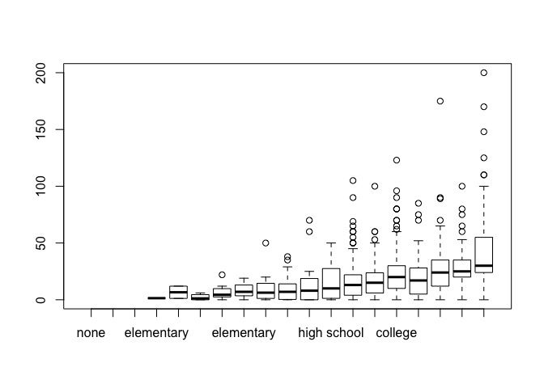

The folder `earnings` has data from the Work, Family, and Well-Being Survey (Ross, 1990). Pull out the data on earnings, sex, height, and weight.

### Part A

*In R, check the dataset and clean any unusually coded data.*

``` r
require(foreign)
require(arm)
require(ggplot2)
```

``` r
df <- read.dta("http://www.stat.columbia.edu/~gelman/arm/examples/earnings/heights.dta")
```

``` r
# exclude NA's
df <- df[complete.cases(df), ]

# scale earnings (in /$1000s)
df$earn <- df$earn / 1000

# factorise `sex` variable (1 = male, 2 = female)
df$sex <- factor(df$sex, labels=c("male", "female"))

# remove three observations where yearbn > 90
df <- df[df$yearbn <= 90,]

# factorise `race` variable (1 = white, 2 = black, 3 = asian, 4 = native american, 5 = else); we also assume those observations where race > 5 were meant to be `else`
df[df$race > 5, ]$race <- 5
df$race <- factor(df$race, labels=c("white", "black", "asian", "native american", "else"))

# factorise `hisp` variable
df$hisp <- factor(df$hisp, labels=c("yes", "no"))

# factorise `ed` variable
#        None . . . . . . . . . . . . . . . . . . . .  00
#        Elementary . . . . . . . 01 02 03 04 05 06 07 08
#        High school . . . . . . . .  . . . . 09 10 11 12
#        College . . . . . . . . . .  . . . . 13 14 15 16
#        Some graduate school . . . . .  . . . . . . . 17
#        Graduate or professional degree . . . . . . . 18
df$ed <- factor(df$ed, levels=0:18, labels=c("none", "elementary", "elementary","elementary","elementary","elementary","elementary","elementary","elementary", "high school", "high school", "high school", "high school", "college", "college", "college", "college", "graduate school", "professional degree"))
```

    ## Warning in `levels<-`(`*tmp*`, value = if (nl == nL) as.character(labels)
    ## else paste0(labels, : duplicated levels in factors are deprecated

``` r
#
summary(df)
```

    ## Warning in `levels<-`(`*tmp*`, value = if (nl == nL) as.character(labels)
    ## else paste0(labels, : duplicated levels in factors are deprecated

    ##       earn           height1         height2           sex     
    ##  Min.   :  0.00   Min.   :4.000   Min.   : 0.000   male  :519  
    ##  1st Qu.:  6.00   1st Qu.:5.000   1st Qu.: 3.000   female:857  
    ##  Median : 16.02   Median :5.000   Median : 5.000               
    ##  Mean   : 19.99   Mean   :5.129   Mean   : 5.048               
    ##  3rd Qu.: 28.00   3rd Qu.:5.000   3rd Qu.: 8.000               
    ##  Max.   :200.00   Max.   :6.000   Max.   :11.000               
    ##                                                                
    ##               race       hisp                        ed     
    ##  white          :1217   yes:  80   high school        :617  
    ##  black          : 126   no :1296   college            :563  
    ##  asian          :  17              professional degree: 80  
    ##  native american:  11              graduate school    : 70  
    ##  else           :   5              elementary         : 46  
    ##                                    none               :  0  
    ##                                    (Other)            :  0  
    ##      yearbn          height     
    ##  Min.   : 1.00   Min.   :58.00  
    ##  1st Qu.:39.00   1st Qu.:64.00  
    ##  Median :52.00   Median :66.00  
    ##  Mean   :48.78   Mean   :66.59  
    ##  3rd Qu.:61.00   3rd Qu.:69.00  
    ##  Max.   :72.00   Max.   :77.00  
    ## 

### Part B

*Fit a linear regression model predicting earnings from height. What transformation should you perform in order to interpret the intercept from this model as average earnings for people with average height?*

``` r
# normalise and scale `height` and `earn`
df$height <- (df$height - mean(df$height)) / (2 * sd(df$height))

# fit linear model
m1 <- lm(earn ~ height, data=df)
display(m1)
```

    ## lm(formula = earn ~ height, data = df)
    ##             coef.est coef.se
    ## (Intercept) 19.99     0.51  
    ## height      11.95     1.02  
    ## ---
    ## n = 1376, k = 2
    ## residual sd = 18.85, R-Squared = 0.09

### Part C

*Fit some regression models with the goal of predicting earnings from some combination of sex, height, and ed. Be sure to try various transformations and interactions that might make sense. Choose your preferred model and justify.*

``` r
# create variable `age`, which is easier to interpret than `yearbn`
df$age <- 90 - df$yearbn
df[, c("age")] <- (df$age - mean(df$age)) / (2 * sd(df$age))
```

``` r
m2 <- lm(earn ~ sex * ed + age + height, data=df)
```

    ## Warning in `levels<-`(`*tmp*`, value = if (nl == nL) as.character(labels)
    ## else paste0(labels, : duplicated levels in factors are deprecated

    ## Warning in `levels<-`(`*tmp*`, value = if (nl == nL) as.character(labels)
    ## else paste0(labels, : duplicated levels in factors are deprecated

``` r
display(m2)
```

    ## lm(formula = earn ~ sex * ed + age + height, data = df)
    ##                                 coef.est coef.se
    ## (Intercept)                      10.81     4.14 
    ## sexfemale                        -7.62     5.28 
    ## edhigh school                    11.17     4.26 
    ## edcollege                        17.87     4.26 
    ## edgraduate school                21.42     5.13 
    ## edprofessional degree            47.46     4.92 
    ## age                               4.54     0.94 
    ## height                            3.37     1.30 
    ## sexfemale:edhigh school          -3.11     5.35 
    ## sexfemale:edcollege              -2.77     5.37 
    ## sexfemale:edgraduate school       0.04     6.59 
    ## sexfemale:edprofessional degree -21.18     6.40 
    ## ---
    ## n = 1376, k = 12
    ## residual sd = 16.87, R-Squared = 0.28

We fit a linear model which takes four inputs:

-   Sex
-   Education: we factorise this variable into 5 classes (none, high school, college, graduate school, professional degree) to help interpretation of the model results
-   Age: this was prefered to `yearbn` because is easier to interpret
-   Height (in inches)

The final model we present here have five predictors:

-   Sex: a binary variable where 1 = male and 2 = female
-   Education
-   Age (in years)
-   Height (in inches)
-   Sex : Education: an interraction term between Sex and Education

We discovered early on that Education has a high predictive power and that male and female differ in their earnings along each additional level of education. This is highlighted in the following graphs.

``` r
# plot educational level against earnings (this is a powerful predictor)
plot(df$ed, df$earn)
```



``` r
# plot sex against earning
plot(df$sex, df$earn)
```


``` r
ggplot(data=df, aes(x=ed, y=earn, col=sex)) + geom_boxplot()
```

    ## Warning in `levels<-`(`*tmp*`, value = if (nl == nL) as.character(labels)
    ## else paste0(labels, : duplicated levels in factors are deprecated

    ## Warning in `levels<-`(`*tmp*`, value = if (nl == nL) as.character(labels)
    ## else paste0(labels, : duplicated levels in factors are deprecated


The residuals of this model are not normally distributed, therefore inferences might be not precise and caution should be taken when interpreting its results. The graphs below help diagnotic the model and highlight how heteroschedasticity plays a big role in our model.

``` r
par(mfrow=c(2,2))
plot(m2)
```


### Part D

*Interpret all model coefficients.*

-   Intercept: the intercept represent the average salary for a male of average age and height which has no education (this is of little help because there are no individuals in our dataset which hasn't al least an elementary school degree)
-   Sex: female who didn't earn any degree and have average age and height, earn $7,620 less then males with similar characteristic. Regarding this point, we should mention that the average height is computed among the entire population and that the females population in isolation has a smaller average height. Therefore females of height equal to the average population height are generally tall females. All this being considered, we expect this coefficient to be a conservative estimale for the effect of sex in our model. We could have created an interraction term between `sex` and `height` to fully consider it into our model but we don't believe `height` plays such a fundamental role in earning predictions
-   Education: better education rates corresponds to higher earnings. In particular we can notice how for a male individual of average age and height there is a big jump in average salary from a graduate degree to a professional degree ($21,420 - $17,870 = $26,040)
-   Age (in years): individuals who are 1 standard deviation from the average age earn $10,810 + $4,540 = $15,350
-   Height (in inches): individuals who are 1 standard deviation from the average height earn $10,810 + $3,370 = $14,180
-   Sex : Education: even though women earn less than male individuals with same characteristic, they seem to be particularly penalised when they have earned a professional degree. In this case their average salary is $21,180 less than what a male individual would have (!)
