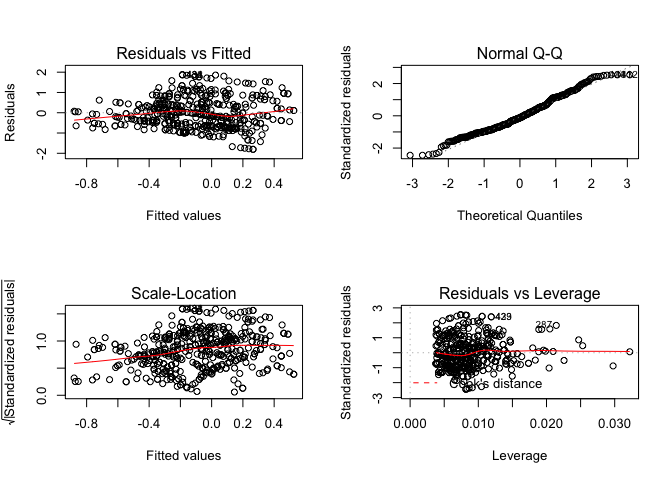
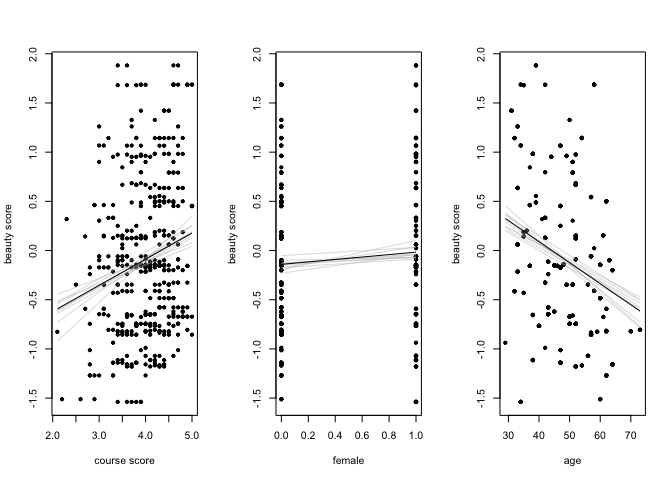
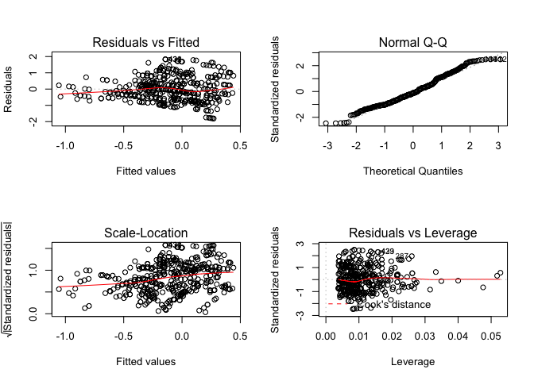
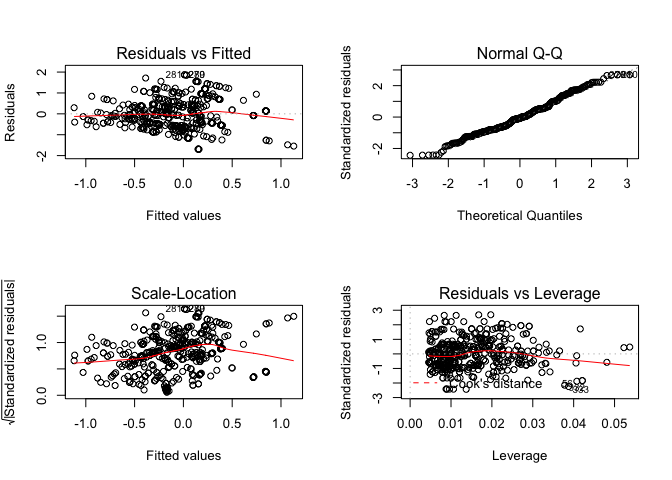
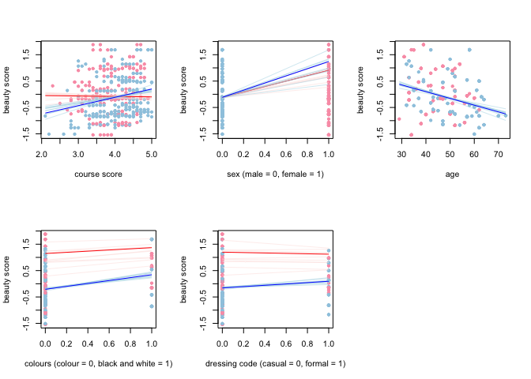

The folder `beauty` contains data from Hamermesh and Parker (2005) on student evaluations of instructors’ beauty and teaching quality for several courses at the University of Texas. The teaching evaluations were conducted at the end of the semester, and the beauty judgments were made later, by six students who had not attended the classes and were not aware of the course evaluations.

``` r
require(arm)
require(foreign)
```

``` r
beauty <- read.csv("http://www.stat.columbia.edu/~gelman/arm/examples/beauty/ProfEvaltnsBeautyPublic.csv")
head(beauty)
```

    ##   tenured profnumber minority age beautyf2upper beautyflowerdiv
    ## 1       0          1        1  36             6               5
    ## 2       1          2        0  59             2               4
    ## 3       1          3        0  51             5               5
    ## 4       1          4        0  40             4               2
    ## 5       0          5        0  31             9               7
    ## 6       1          6        0  62             5               6
    ##   beautyfupperdiv beautym2upper beautymlowerdiv beautymupperdiv  btystdave
    ## 1               7             6               2               4  0.2015666
    ## 2               4             3               2               3 -0.8260813
    ## 3               2             3               2               3 -0.6603327
    ## 4               5             2               3               3 -0.7663125
    ## 5               9             6               7               6  1.4214450
    ## 6               6             6               5               5  0.5002196
    ##    btystdf2u   btystdfl   btystdfu  btystdm2u   btystdml   btystdmu class1
    ## 1  0.2893519  0.4580018  0.8758139  0.6817153 -0.9000649 -0.1954181      0
    ## 2 -1.6193560 -0.0735065 -0.5770065 -1.1319040 -0.9000649 -0.6546507      0
    ## 3 -0.1878249  0.4580018 -1.5455530 -1.1319040 -0.9000649 -0.6546507      0
    ## 4 -0.6650018 -1.1365230 -0.0927330 -1.7364440 -0.3125226 -0.6546507      0
    ## 5  1.7208830  1.5210190  1.8443610  0.6817153  2.0376470  0.7230470      0
    ## 6 -0.1878249  0.9895102  0.3915404  0.6817153  0.8625621  0.2638144      0
    ##   class2 class3 class4 class5 class6 class7 class8 class9 class10 class11
    ## 1      0      1      0      0      0      0      0      0       0       0
    ## 2      0      0      0      0      0      0      0      0       0       0
    ## 3      0      0      1      0      0      0      0      0       0       0
    ## 4      1      0      0      0      0      0      0      0       0       0
    ## 5      0      0      0      0      0      0      0      0       0       0
    ## 6      0      0      0      0      0      0      0      0       0       0
    ##   class12 class13 class14 class15 class16 class17 class18 class19 class20
    ## 1       0       0       0       0       0       0       0       0       0
    ## 2       0       0       0       0       0       0       0       0       0
    ## 3       0       0       0       0       0       0       0       0       0
    ## 4       0       0       0       0       0       0       0       0       0
    ## 5       0       0       0       0       0       0       0       0       0
    ## 6       0       0       0       0       0       0       0       0       0
    ##   class21 class22 class23 class24 class25 class26 class27 class28 class29
    ## 1       0       0       0       0       0       0       0       0       0
    ## 2       0       0       0       0       0       0       0       0       0
    ## 3       0       0       0       0       0       0       0       0       0
    ## 4       0       0       0       0       0       0       0       0       0
    ## 5       0       0       0       0       0       0       0       0       0
    ## 6       0       0       0       0       0       0       0       0       0
    ##   class30 courseevaluation didevaluation female formal fulldept lower
    ## 1       0              4.3            24      1      0        1     0
    ## 2       0              4.5            17      0      0        1     0
    ## 3       0              3.7            55      0      0        1     0
    ## 4       0              4.3            40      1      0        1     0
    ## 5       0              4.4            42      1      0        1     0
    ## 6       0              4.2           182      0      1        1     0
    ##   multipleclass nonenglish onecredit percentevaluating profevaluation
    ## 1             1          0         0          55.81395            4.7
    ## 2             0          0         0          85.00000            4.6
    ## 3             1          0         0         100.00000            4.1
    ## 4             1          0         0          86.95652            4.5
    ## 5             0          0         0          87.50000            4.8
    ## 6             0          0         0          64.53901            4.4
    ##   students tenuretrack blkandwhite btystdvariance btystdavepos
    ## 1       43           1           0      2.1298060     0.201567
    ## 2       20           1           0      1.3860810     0.000000
    ## 3       55           1           0      2.5374350     0.000000
    ## 4       46           1           0      1.7605770     0.000000
    ## 5       48           1           0      1.6931000     1.421450
    ## 6      282           1           0      0.9447419     0.500220
    ##   btystdaveneg
    ## 1     0.000000
    ## 2    -0.826081
    ## 3    -0.660333
    ## 4    -0.766312
    ## 5     0.000000
    ## 6     0.000000

### Part a

*Run a regression using beauty (the variable `btystdave`) to predict course evaluations (`courseevaluation`), controlling for various other inputs. Display the fitted model graphically, and explaining the meaning of each of the coefficients, along with the residual standard deviation. Plot the residuals versus fitted values.*

``` r
m1 <- lm(btystdave ~ courseevaluation + female + age, data=beauty)
display(m1)
```

    ## lm(formula = btystdave ~ courseevaluation + female + age, data = beauty)
    ##                  coef.est coef.se
    ## (Intercept)      -0.17     0.34  
    ## courseevaluation  0.27     0.06  
    ## female            0.12     0.07  
    ## age              -0.02     0.00  
    ## ---
    ## n = 463, k = 4
    ## residual sd = 0.74, R-Squared = 0.12

``` r
par(mfrow=c(2,2))
plot(m1)
```



We fitted a model which tries to explain the variance of the variable `btystdave` using a linear combination of `courseevaluation`, `female` and `age`. The above graphs help us to understand how the residuals are distributed in order to splot unusual behaviours we can leverage to improve our model.

The first and third graph (top-left and bottom-left) show some heteroschedasticity in the residuals, which means the residuals do not have equal variance. In the presence of heteroscedasticity, OLS estimates are unbiased, but the usual tests of significance are generally inappropriate and their use can lead to incorrect inferences. The second plot (top-right) shows that residuals are not perfectly normal, which makes inferences based on this model not reliable. However, the model can still be used to understand how variables interract which each other. From the last plot (bottom-right) we can see there are many residuals which fall far away from 0. This is consistent with the previous observations and suggests that more work should be done to improve our model.

We won't pay excessive attention to coefficient's standard error (and p-values) because of the presence of heteroschedasticity and not normal distributed residuals. Anyway, we can from the model's summary results that `courseevaluation` is by far the most prominent variable in our model. Students which scored 0.1 points higher have on average 0.27 beauty score. At the same time, female student do generally have a better beauty score; if a student is female, in fact, she will generally have a beauty score 0.12 higher than a male student with same course evaluation and age. The last covariate in our model is `age`. We can notice this has a mildly negative coefficient. With every additional year of age, beauty score tends to decrease by 0.02.

``` r
beta.hat <- coef(m1) 
beta.sim <- sim(m1)@coef
par(mfrow=c(1,3))

# plot course evaluation against beauty score
plot(beauty$courseevaluation, beauty$btystdave, pch=20, xlab="course score", ylab="beauty score")
for (i in 1:10){
  curve (cbind (1, x, mean(beauty$female), mean(beauty$age)) %*% beta.sim[i,], lwd=.5, col="gray", add=TRUE)
}
curve (cbind (1, x, mean(beauty$female), mean(beauty$age)) %*% beta.hat, col="black", add=TRUE)

# plot sex against beauty score
plot(beauty$female, beauty$btystdave, pch=20, xlab="female", ylab="beauty score")
for (i in 1:10){
  curve (cbind (1, mean(beauty$courseevaluation), x, mean(beauty$age)) %*% beta.sim[i,], lwd=.5, col="gray", add=TRUE)
}
curve (cbind (1, mean(beauty$courseevaluation), x, mean(beauty$age)) %*% beta.hat, col="black", add=TRUE)

# plot age against beauty score
plot(beauty$age, beauty$btystdave, pch=20, xlab="age", ylab="beauty score")
for (i in 1:10){
  curve (cbind (1, mean(beauty$courseevaluation), mean(beauty$female), x) %*% beta.sim[i,], lwd=.5, col="gray", add=TRUE)
}
curve (cbind (1, mean(beauty$courseevaluation), mean(beauty$female), x) %*% beta.hat, col="black", add=TRUE)
```



### Part b

*Fit some other models, including beauty and also other input variables. Consider at least one model with interactions. For each model, state what the predictors are, and what the inputs are (see Section 3.7), and explain the meaning of each of its coefficients.*

``` r
m2 <- lm(btystdave ~ courseevaluation * female + age, data=beauty)
display(m2)
```

    ## lm(formula = btystdave ~ courseevaluation * female + age, data = beauty)
    ##                         coef.est coef.se
    ## (Intercept)             -0.51     0.39  
    ## courseevaluation         0.36     0.08  
    ## female                   1.02     0.51  
    ## age                     -0.02     0.00  
    ## courseevaluation:female -0.23     0.13  
    ## ---
    ## n = 463, k = 5
    ## residual sd = 0.74, R-Squared = 0.13

``` r
par(mfrow=c(2,2))
plot(m2)
```



`m2` is a particularly interesting model because in addition to `m1` shows the interraction term between the score in the class and sex. From the summary table above we can see all coefficients are significant. In particular it seems that, even though females have generally a beauty score higher than male students with similar characteristics, the higher their score on the class the lower is their beauty score compared to similar male students.

We will now fit a model which, compared to `m2`, adds a few more input variables. As we will see, this model, although slighly more complicated, will be able to explain better the variance of our outcome variable.

``` r
m3 <- lm(btystdave ~ courseevaluation * female + age + blkandwhite + formal, data=beauty)
display(m3)
```

    ## lm(formula = btystdave ~ courseevaluation * female + age + blkandwhite + 
    ##     formal, data = beauty)
    ##                         coef.est coef.se
    ## (Intercept)             -0.27     0.37  
    ## courseevaluation         0.31     0.08  
    ## female                   1.36     0.49  
    ## age                     -0.03     0.00  
    ## blkandwhite              0.55     0.09  
    ## formal                   0.25     0.09  
    ## courseevaluation:female -0.33     0.12  
    ## ---
    ## n = 463, k = 7
    ## residual sd = 0.70, R-Squared = 0.22

``` r
par(mfrow=c(2,2))
plot(m3)
```



This last model looks much better than `m1` and `m2`. To begin with residuals are almost normal and heteroschedasticity, althogh still present, looks less of a concern. The addition of `blkandwhite` and `formal` increased by a significant amount R-squared too; our model now explains about 22% of the beauty score variation.

Model `m3` includes five inputs:

-   `courseevaluation`: an ordinal numerical variable which represent the score in the class test
-   `female`: a binary variable which takes value of 1 when the subject was a female, and 0 when male
-   `age`: an ordinal numerical variable to represent the age of the subject on the picture
-   `blkandwhite`: a binary variable which takes value of 1 when the picture is black and white and 0 when it was in colours
-   `formal`: a binary variable which takes value of 1 when the subject in the picture was wearing formal clothes, and 0 when it wasn't

In the model we have six predictors:

-   `courseevaluation`: the coefficient represents the slope of this variable, among those subjects for whom variables `female`, `age`, `blkandwhite` and `formal` equal to 0
-   `female`: the coefficient represents the predicted difference for subjects that differ in sex, among those with `courseevaluation`, `age`, `blkandwhite` and `formal` equal to 0
-   `age`: the coefficient represents the slope of this variable, among those subjects for whom variables `courseevaluation`, `female`, `blkandwhite` and `formal` equal to 0
-   `blkandwhite`: the coefficient represents the predicted difference for subjects that differ in picture colour, among those with `courseevaluation`, `female`, `age` and `formal` equal to 0
-   `formal`: the coefficient represents the predicted difference for subjects that differ in clothing type, among those with `courseevaluation`, sex, `age` and `blkandwhite` equal to 0
-   `courseevaluation:female`: the coefficient on the interaction term represents the difference in the slope, comparing subjects that are females to those that are males


