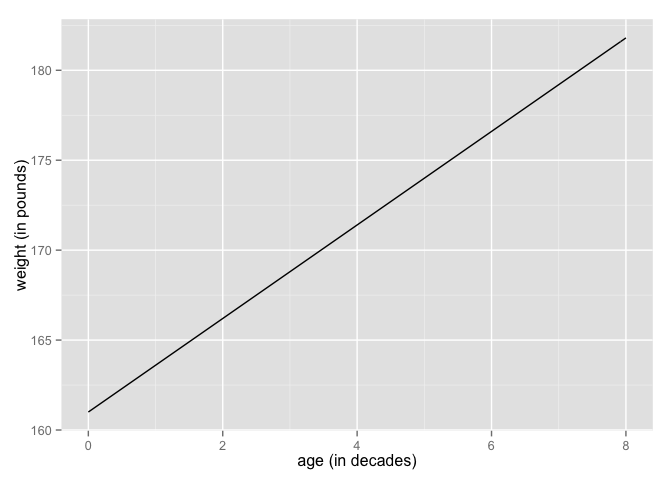
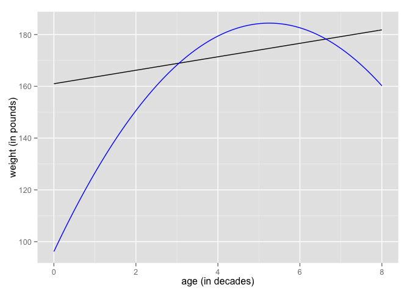
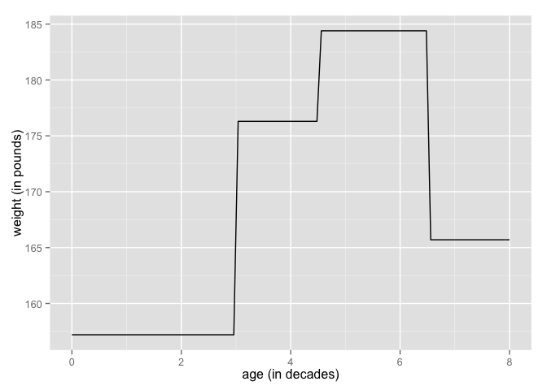

# Chapter 4, Problem 3 (Gelman & Hill)
Gianluca Rossi  
3 November 2015  

*Plotting linear and nonlinear regressions: we downloaded data with weight (in pounds) and age (in years) from a random sample of American adults. We first created new variables: age10 = age/10 and age10.sq = (age/10)^2, and indicators age18.29, age30.44, age45.64, and age65up for four age categories. We then fit some regressions, with the following results:*


```r
lm(formula = weight ~ age10)
                  coef.est coef.se 
(Intercept)       161.0     7.3 
age10             2.6       1.6
---
  n = 2009, k = 2
  residual sd = 119.7, R-Squared = 0.00
  

lm(formula = weight ~ age10 + age10.sq) 
                  coef.est coef.se
(Intercept)       96.2      19.3 
age10             33.6      8.7 
age10.sq          -3.2      0.9
---
  n = 2009, k = 3, 
  residual sd = 119.3, R-Squared = 0.01


lm(formula = weight ~ age30.44 + age45.64 + age65up)
                  coef.est coef.se
(Intercept)       157.2    5.4
age30.44TRUE      19.1     7.0
age45.64TRUE      27.2     7.6
age65upTRUE       8.5      8.7
---
  n = 2009, k = 4
  residual sd = 119.4, R-Squared = 0.01
```

### Part A

*On a graph of weights versus age (that is, weight on y-axis, age on x-axis), draw the fitted regression line from the first model.*


```r
require(ggplot2)
```


```r
ggplot(data.frame(x=c(0, 8)), aes(x)) + stat_function(fun=function(x) 161+2.6*x) + labs(x="age (in decades)", y="weight (in pounds)")
```

 

### Part B

*On the same graph, draw the fitted regression line from the second model.*


```r
ggplot(data.frame(x=c(0, 8)), aes(x)) + 
    stat_function(fun=function(x) 161 + 2.6*x) +
    stat_function(fun=function(x) 96.2 + 33.6*x - 3.2*(x)^2, col="blue") + 
    labs(x="age (in decades)", y="weight (in pounds)")
```

 

### Part C

*On another graph with the same axes and scale, draw the fitted regression line from the third model. (It will be discontinuous.)*


```r
ggplot(data.frame(x=c(0, 8)), aes(x)) + 
    stat_function(fun=function(x) 157.2 + 
                    19.1*ifelse(3<=x & x<=4.49, 1, 0) + 
                    27.2*ifelse(4.5<=x & x<=6.49, 1, 0) + 
                    8.5*ifelse(6.5<=x, 1, 0)) + 
    labs(x="age (in decades)", y="weight (in pounds)")
```

 
