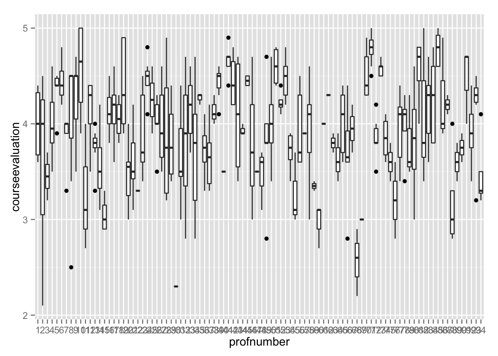
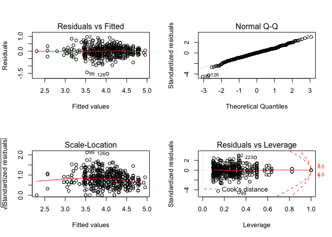
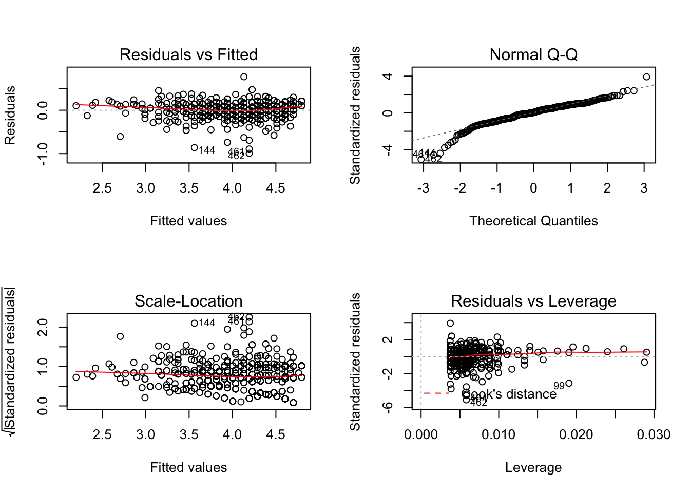
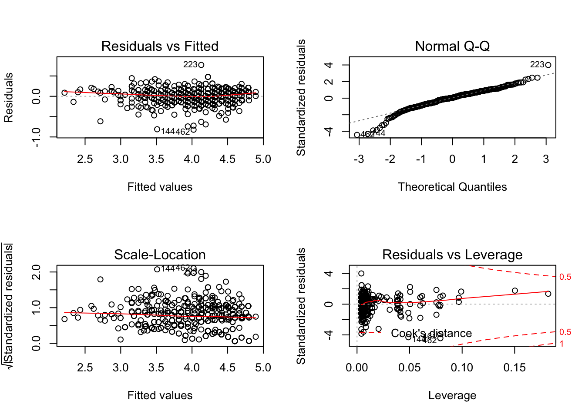

# Chapter 4, Problem 8 (Gelman & Hill)
Gianluca Rossi  
6 November 2015  

*Return to the teaching evaluations data from Exercise 3.5. Fit regression models predicting evaluations given many of the inputs in the dataset. Consider interactions, combinations of predictors, and transformations, as appropriate. Consider several models, discuss in detail the final model that you choose, and also explain why you chose it rather than the others you had considered*

Using the `ProfEvaltnsBeautyPublic` datasets, we will try to predict the score given by the students to a class, based on a number of factors. In our dataset, each row corresponds in a score, given by a unique student, to a class. There are many variables included in the dataset, including some characteristic of the professor (i.e. `age`, `female`, `tenured`, `minority`, beauty) and the class (i.e. `students`, `lower`, `tenuretrack`).

Before we begin our analysis, we invite the reader to look up for additional information regarding the dataset at [this link](http://www.stat.columbia.edu/~gelman/arm/examples/beauty/ProfEvaltnsBeautyPublic.log). It's very important for the reader to become familiar with what each variable represents before moving to the remaining part of this document.


```r
require(arm)
require(ggplot2)
require(foreign)
```


```r
df <- read.csv("http://www.stat.columbia.edu/~gelman/arm/examples/beauty/ProfEvaltnsBeautyPublic.csv")

# convert into factors
df$profnumber <- as.factor(df$profnumber)
df$female <- as.factor(df$female)

# return column names
colnames(df)
```

```
##  [1] "tenured"           "profnumber"        "minority"         
##  [4] "age"               "beautyf2upper"     "beautyflowerdiv"  
##  [7] "beautyfupperdiv"   "beautym2upper"     "beautymlowerdiv"  
## [10] "beautymupperdiv"   "btystdave"         "btystdf2u"        
## [13] "btystdfl"          "btystdfu"          "btystdm2u"        
## [16] "btystdml"          "btystdmu"          "class1"           
## [19] "class2"            "class3"            "class4"           
## [22] "class5"            "class6"            "class7"           
## [25] "class8"            "class9"            "class10"          
## [28] "class11"           "class12"           "class13"          
## [31] "class14"           "class15"           "class16"          
## [34] "class17"           "class18"           "class19"          
## [37] "class20"           "class21"           "class22"          
## [40] "class23"           "class24"           "class25"          
## [43] "class26"           "class27"           "class28"          
## [46] "class29"           "class30"           "courseevaluation" 
## [49] "didevaluation"     "female"            "formal"           
## [52] "fulldept"          "lower"             "multipleclass"    
## [55] "nonenglish"        "onecredit"         "percentevaluating"
## [58] "profevaluation"    "students"          "tenuretrack"      
## [61] "blkandwhite"       "btystdvariance"    "btystdavepos"     
## [64] "btystdaveneg"
```

Before getting started, we need to manipulate a bit the original dataset in order to make it easier for us work. You may have noticed how there are 30 dummy variables to represent the class the score corresponds to. This sounds like a very important predictor, thus we may want to consider it into our regression model. To plot the relation between scores and classes we will transform the 30 dummy variables into one factor (with 30 levels).


```r
# convert dummy `class*` variables into a factor
dummies <- df[, 18:47]
df$class <- factor(apply(dummies, FUN=function(r) r %*% 1:30, MARGIN=1))

# remove dummy variables
df <- df[-c(18:47)]

# boxplot of class vs course evaluation
ggplot(data=df, aes(x=class, y=courseevaluation)) + geom_boxplot() +
  labs(title="Distribution of grades by student class", x="Class", y="Course Evaluation")
```

 

As you can see from the graph above, different classes corresponds to different score distributions. In particular, class 15 stands out for his very poor score distribution (something the University might consider in the future).


```r
# TODO: order boxplots based on average score
ggplot(data=df, aes(x=profnumber, y=courseevaluation)) + geom_boxplot()
```

 

Even though there are very few observations for certain professors, we can still see how, expectedly, course evaluation varies greatly based on which professor taught the class. 


```r
ggplot(data=df, aes(x=female, y=courseevaluation)) + geom_boxplot()
```

 

We will start now fitting a very simple model which includes as predictors the sex of the professor, the class id and the professor id.


```r
m1 <- lm(courseevaluation ~ female + profnumber + class, data=df)
display(m1)
```

```
## lm(formula = courseevaluation ~ female + profnumber + class, 
##     data = df)
##              coef.est coef.se
## (Intercept)   4.15     0.16  
## female1      -0.03     0.36  
## profnumber2  -0.62     0.28  
## profnumber3  -0.45     0.35  
## profnumber4  -0.17     0.35  
## profnumber5   0.20     0.36  
## profnumber6   0.36     0.22  
## profnumber7  -0.06     0.34  
## profnumber8  -0.10     0.35  
## profnumber9   0.11     0.35  
## profnumber10  0.51     0.21  
## profnumber11 -0.63     0.31  
## profnumber12 -0.04     0.24  
## profnumber13 -0.34     0.24  
## profnumber14 -0.45     0.26  
## profnumber15 -1.06     0.42  
## profnumber16  0.10     0.34  
## profnumber17 -0.27     0.40  
## profnumber18 -0.10     0.21  
## profnumber19  0.22     0.34  
## profnumber20 -0.64     0.34  
## profnumber21 -0.52     0.37  
## profnumber22 -1.05     0.79  
## profnumber23 -0.31     0.36  
## profnumber24  0.32     0.22  
## profnumber25  0.13     0.42  
## profnumber26 -0.08     0.49  
## profnumber27 -0.19     0.28  
## profnumber28 -0.26     0.30  
## profnumber29  0.36     0.41  
## profnumber30 -0.32     0.69  
## profnumber31 -0.49     0.22  
## profnumber32  0.15     0.32  
## profnumber33 -0.03     0.24  
## profnumber34 -0.26     0.36  
## profnumber35 -0.13     0.36  
## profnumber36 -0.23     0.38  
## profnumber37 -0.64     0.23  
## profnumber38 -0.11     0.28  
## profnumber39  0.23     0.23  
## profnumber40 -0.29     0.55  
## profnumber41  0.51     0.24  
## profnumber42  0.55     0.32  
## profnumber43  0.13     0.38  
## profnumber44  0.28     0.48  
## profnumber45  0.48     0.27  
## profnumber46  0.15     0.48  
## profnumber47 -1.35     0.56  
## profnumber48 -0.16     0.55  
## profnumber49 -0.37     0.36  
## profnumber50 -0.35     0.21  
## profnumber51  0.48     0.36  
## profnumber52  0.03     0.26  
## profnumber53  0.23     0.38  
## profnumber54 -0.41     0.36  
## profnumber55 -1.06     0.30  
## profnumber56 -0.32     0.25  
## profnumber57 -0.22     0.42  
## profnumber58 -0.21     0.34  
## profnumber59 -0.80     0.39  
## profnumber60 -1.16     0.39  
## profnumber61 -0.15     0.42  
## profnumber62  0.15     0.42  
## profnumber63 -0.32     0.42  
## profnumber64 -0.49     0.39  
## profnumber65 -0.11     0.35  
## profnumber66 -0.47     0.23  
## profnumber67 -0.20     0.32  
## profnumber68 -1.58     0.28  
## profnumber69 -1.12     0.50  
## profnumber70  0.36     0.21  
## profnumber71  0.63     0.20  
## profnumber72 -0.30     0.23  
## profnumber73  0.43     0.24  
## profnumber74 -0.30     0.25  
## profnumber75 -0.07     0.53  
## profnumber76 -0.92     0.42  
## profnumber77  0.13     0.39  
## profnumber78  0.03     0.28  
## profnumber79 -0.35     0.28  
## profnumber80 -0.30     0.37  
## profnumber81  0.28     0.26  
## profnumber82 -0.06     0.20  
## profnumber83  0.06     0.36  
## profnumber84  0.09     0.46  
## profnumber85  0.66     0.31  
## profnumber86  0.12     0.28  
## profnumber87  0.05     0.32  
## profnumber88 -0.99     0.22  
## profnumber89 -0.52     0.39  
## profnumber90 -0.40     0.32  
## profnumber91  0.34     0.39  
## profnumber92 -0.21     0.35  
## profnumber94 -0.65     0.37  
## class1        0.20     0.25  
## class2        0.31     0.30  
## class3       -0.12     0.25  
## class4       -0.25     0.15  
## class5        0.19     0.21  
## class6       -0.21     0.32  
## class7       -0.60     0.30  
## class8        0.23     0.60  
## class9       -0.02     0.25  
## class10       0.47     0.30  
## class11       0.54     0.32  
## class12      -0.14     0.26  
## class13      -0.12     0.30  
## class14      -0.36     0.36  
## class15      -1.50     0.48  
## class16       0.29     0.28  
## class17       0.28     0.19  
## class18       0.17     0.26  
## class19      -0.69     0.32  
## class20       0.49     0.21  
## class21      -0.36     0.18  
## class22      -0.50     0.39  
## class23       0.73     0.23  
## class24      -0.30     0.46  
## class25       0.00     0.44  
## class26       0.13     0.25  
## class27       0.07     0.30  
## class28       0.14     0.34  
## class29      -0.45     0.32  
## class30      -0.01     0.28  
## ---
## n = 463, k = 124
## residual sd = 0.39, R-Squared = 0.64
```

```r
# plot residuals of `m1` model
par(mfrow=c(2,2))
plot(m1)
```

```
## Warning: not plotting observations with leverage one:
##   22, 61, 62, 69, 211, 234
```

```
## Warning: not plotting observations with leverage one:
##   22, 61, 62, 69, 211, 234
```

```
## Warning in sqrt(crit * p * (1 - hh)/hh): NaNs produced
```

```
## Warning in sqrt(crit * p * (1 - hh)/hh): NaNs produced
```

 

Even though the results are encouraging we need to disclaim since now that convidering the no-pooling approach and the limited number of observations for each combination of `profnumber` and `class` we might be overfitting the data (note: n = 463, k = 124). We are not surprised by the extremely high R-squared considering.


```r
# display the number of observations for each combination of professor and class (class0 is an unknown class)
table(df$profnumber, df$class)
```

```
##     
##       0  1  2  3  4  5  6  7  8  9 10 11 12 13 14 15 16 17 18 19 20 21 22
##   1   0  0  0  4  0  0  0  0  0  0  0  0  0  0  0  0  0  0  0  0  0  0  0
##   2   3  0  0  0  0  0  0  0  0  0  0  0  0  0  0  0  0  0  0  0  0  0  0
##   3   0  0  0  0  2  0  0  0  0  0  0  0  0  0  0  0  0  0  0  0  0  0  0
##   4   3  0  1  0  1  1  0  0  0  0  0  0  0  0  0  0  0  0  0  0  0  0  0
##   5   5  0  0  0  0  0  0  0  0  0  0  0  0  0  0  0  0  0  0  0  0  0  0
##   6   5  0  0  0  2  0  0  0  0  0  0  0  0  0  0  0  0  0  0  0  0  0  0
##   7   0  0  0  1  4  0  0  0  0  0  0  0  0  0  0  0  0  0  0  0  0  0  0
##   8   7  0  0  0  0  0  0  0  0  0  0  0  0  0  0  0  0  0  0  0  0  0  0
##   9   4  0  1  0  1  0  0  0  0  0  0  0  0  0  0  0  0  0  0  0  0  0  0
##   10  6  0  0  0  4  0  0  0  0  0  0  0  0  0  0  0  0  0  0  0  0  0  0
##   11  0  0  0  0  3  0  0  0  0  0  0  0  0  0  0  0  0  0  0  0  0  0  0
##   12  4  0  0  0  0  0  0  0  0  0  0  0  0  0  0  0  0  0  0  0  0  0  0
##   13  4  0  0  3  0  0  0  0  0  0  0  0  0  0  0  0  0  0  0  0  0  0  0
##   14  2  0  0  0  2  0  0  0  0  0  0  0  0  0  0  0  0  0  0  0  0  0  0
##   15  1  0  0  0  0  0  0  0  0  3  0  0  0  0  0  0  0  0  0  0  0  0  0
##   16  0  0  0  0  0  0  3  0  0  3  0  0  0  0  0  0  0  0  0  0  0  0  0
##   17  2  0  0  0  0  0  0  0  0  0  3  0  0  0  0  0  0  0  0  0  0  0  0
##   18  8  0  0  0  0  0  0  0  0  0  0  0  0  0  0  0  0  0  0  0  0  0  0
##   19  9  0  0  0  0  0  0  0  0  0  0  0  0  0  0  0  0  0  0  0  0  0  0
##   20 10  0  0  0  0  0  0  0  0  0  0  0  0  0  0  0  0  0  0  0  0  0  0
##   21  4  0  0  0  0  0  0  0  0  2  0  0  0  0  0  0  0  0  0  0  0  0  0
##   22  0  0  0  0  0  0  0  0  1  0  0  0  0  0  0  0  0  0  0  0  0  0  0
##   23  0  0  0  0  0  0  3  0  0  0  2  0  0  0  0  0  0  0  0  0  0  0  0
##   24  7  0  0  0  0  0  0  0  0  0  0  0  0  0  0  0  0  0  0  0  0  0  0
##   25  2  0  0  0  0  0  0  0  0  0  0  0  0  0  0  0  0  0  0  0  0  0  0
##   26  0  0  0  0  0  0  0  0  1  0  0  0  0  0  0  0  0  0  0  0  0  0  0
##   27  1  0  0  0  0  0  0  0  0  0  0  0  0  0  2  0  0  2  2  0  0  0  0
##   28  1  0  0  0  0  0  0  0  0  0  0  0  0  2  0  0  0  1  0  0  0  0  0
##   29  0  0  0  0  0  0  0  0  0  0  0  0  0  0  0  0  0  0  0  4  0  0  0
##   30  0  0  0  0  0  0  0  0  0  0  0  0  0  0  0  1  0  0  0  0  0  0  0
##   31  5  0  0  0  0  1  0  0  0  0  0  0  1  0  0  0  0  0  0  0  0  0  0
##   32  2  0  0  0  0  0  0  0  0  0  0  0  0  0  0  1  0  0  0  0  0  0  0
##   33  4  0  0  0  0  1  0  0  0  0  0  0  0  0  0  0  0  0  0  0  0  0  0
##   34  2  0  0  0  0  0  0  0  0  0  0  0  0  0  0  0  0  0  0  0  2  9  0
##   35  0  0  0  0  0  0  0  0  0  0  0  0  0  0  0  0  2  0  1  0  0  0  0
##   36  3  0  0  0  0  0  0  0  0  0  0  0  0  0  0  0  0  0  0  1  0  0  0
##   37  4  0  0  0  0  1  0  0  0  0  0  0  0  0  0  0  2  1  0  0  0  0  0
##   38  2  0  0  0  0  0  0  0  0  0  0  0  0  0  0  0  0  1  0  0  0  0  0
##   39  3  0  0  0  0  0  0  0  0  0  0  0  2  0  0  0  0  2  1  0  0  0  0
##   40  0  0  0  0  0  0  0  0  0  0  0  0  0  0  1  0  0  0  0  0  0  0  0
##   41  5  0  0  0  0  0  0  0  0  0  0  0  0  0  0  0  0  0  0  0  0  0  0
##   42  2  0  0  0  0  0  0  0  0  0  0  0  0  0  0  0  0  0  0  0  0  0  2
##   43  2  0  0  0  0  0  0  0  0  0  0  0  0  0  0  0  0  0  0  0  0  2  0
##   44  0  0  0  0  0  0  0  0  0  0  0  0  0  0  0  0  0  0  0  0  0  0  3
##   45  2  0  0  0  0  0  0  0  0  0  0  0  0  0  0  0  0  0  0  0  0  2  0
##   46  0  0  0  0  0  0  0  0  0  0  0  0  0  0  0  0  0  0  0  0  0  0  3
##   47  0  0  0  0  0  0  0  0  0  0  0  0  0  0  0  0  0  0  0  0  0  0  0
##   48  0  0  0  0  0  0  0  0  0  0  0  0  0  0  0  0  0  0  0  0  0  0  3
##   49  4  0  0  0  0  0  0  0  0  0  0  0  0  0  0  0  0  0  0  0  2  1  0
##   50  9  0  0  0  0  0  0  0  0  0  0  0  0  0  0  0  0  0  0  0  0  0  0
##   51  6  0  0  0  0  0  0  0  0  0  0  0  0  0  0  0  0  0  0  0  0  0  0
##   52  3  1  0  0  0  0  0  0  0  0  0  0  0  0  0  0  0  0  0  0  0  0  0
##   53  3  4  0  0  0  0  0  0  0  0  0  0  0  0  0  0  0  0  0  0  0  0  0
##   54  6  0  0  0  0  0  0  0  0  0  0  0  0  0  0  0  0  0  0  0  0  0  0
##   55  2  0  0  0  0  0  0  0  0  0  0  1  0  0  0  0  0  0  0  0  0  0  0
##   56  4  0  0  0  0  0  0  0  0  0  0  1  0  0  0  0  0  0  0  0  0  0  0
##   57  2  0  0  0  0  0  0  0  0  0  0  0  0  0  0  0  0  0  0  0  0  0  0
##   58 10  0  0  0  0  0  0  0  0  0  0  0  0  0  0  0  0  0  0  0  0  0  0
##   59  1  0  0  0  0  0  0  0  0  0  0  0  0  0  0  0  0  0  0  0  0  0  0
##   60  3  0  0  0  0  0  0  0  0  0  0  0  0  0  0  0  0  0  0  0  0  0  0
##   61  1  0  0  0  0  0  0  0  0  0  0  0  0  0  0  0  0  0  0  0  0  0  0
##   62  1  0  0  0  0  0  0  0  0  0  0  0  0  0  0  0  0  0  0  0  0  0  0
##   63  2  0  0  0  0  0  0  0  0  0  0  0  0  0  0  0  0  0  0  0  0  0  0
##   64  3  0  0  0  0  0  0  0  0  0  0  0  0  0  0  0  0  0  0  0  0  0  0
##   65  7  0  0  0  0  0  0  0  0  0  0  0  0  0  0  0  0  0  0  0  0  0  0
##   66  6  0  0  0  0  0  0  0  0  0  0  0  0  0  0  0  0  0  0  0  0  0  0
##   67  2  0  0  0  0  0  0  0  0  0  0  0  0  0  0  0  0  0  0  0  0  0  0
##   68  3  0  0  0  0  0  0  0  0  0  0  0  0  0  0  0  0  0  0  0  0  0  0
##   69  1  0  0  0  0  0  0  0  0  0  0  0  0  0  0  0  0  0  0  0  0  0  0
##   70  9  0  0  0  0  0  0  0  0  0  0  0  0  0  0  0  0  0  0  0  0  0  0
##   71 10  0  0  0  0  0  0  0  0  0  0  0  0  0  0  0  0  0  0  0  0  0  0
##   72  6  0  0  0  0  0  0  0  0  0  0  0  0  0  0  0  0  0  0  0  0  0  0
##   73  5  0  0  0  0  0  0  0  0  0  0  0  0  0  0  0  0  0  0  0  0  0  0
##   74  4  0  0  0  0  0  0  0  0  0  0  0  0  0  0  0  0  0  0  0  0  0  0
##   75  0  0  0  0  0  0  0  1  0  0  0  0  0  0  0  0  0  0  0  0  0  0  0
##   76  2  0  0  0  0  0  0  0  0  0  0  0  0  0  0  0  0  0  0  0  0  0  0
##   77  3  0  0  0  0  0  0  3  0  0  0  0  0  0  0  0  0  0  0  0  0  0  0
##   78  2  0  0  0  0  0  0  0  0  0  0  0  0  1  0  0  0  0  0  1  0  0  0
##   79  3  0  0  0  0  0  0  0  0  0  0  0  0  0  0  0  0  0  0  0  0  0  0
##   80  4  0  0  0  0  0  0  0  0  0  0  0  0  0  0  0  0  0  0  0  0  0  0
##   81  3  0  0  0  0  0  0  0  0  0  0  0  0  0  0  0  0  0  0  0  1  0  0
##   82  9  0  0  0  0  0  0  0  0  0  0  0  0  0  0  0  0  0  0  0  0  0  0
##   83  5  0  0  0  0  0  0  0  0  0  0  0  0  0  0  0  0  0  0  0  0  0  0
##   84  0  0  0  0  0  0  0  0  0  0  0  0  0  0  0  0  0  0  0  0  0  0  0
##   85  1  0  0  0  0  0  0  0  0  0  0  0  0  0  0  0  0  0  0  0  0  0  0
##   86  3  0  0  0  0  0  0  0  0  0  0  0  0  0  0  0  0  0  0  0  0  0  0
##   87  2  0  0  0  0  0  0  0  0  0  0  0  0  0  0  0  0  0  0  0  0  0  0
##   88  7  0  0  0  0  0  0  0  0  0  0  0  0  0  0  0  0  0  0  0  0  0  0
##   89  3  0  0  0  0  0  0  0  0  0  0  0  0  0  0  0  0  0  0  0  0  0  0
##   90  2  0  0  0  0  0  0  0  0  0  0  0  0  0  0  0  0  0  0  0  0  0  0
##   91  3  0  0  0  0  0  0  0  0  0  0  0  0  0  0  0  0  0  0  0  0  0  0
##   92  7  0  0  0  0  0  0  0  0  0  0  0  0  0  0  0  0  0  0  0  0  0  0
##   93  6  0  0  0  0  0  0  0  0  0  0  0  0  0  0  0  0  0  0  0  0  0  0
##   94  4  0  0  0  0  0  0  0  0  0  0  0  0  0  0  0  0  0  0  0  0  0  0
##     
##      23 24 25 26 27 28 29 30
##   1   0  0  0  0  0  0  0  0
##   2   0  0  0  0  0  0  0  0
##   3   0  0  0  0  0  0  0  0
##   4   0  0  0  1  1  0  0  0
##   5   0  0  0  1  0  0  0  0
##   6   0  0  0  0  0  0  0  0
##   7   0  0  0  0  0  0  0  0
##   8   0  0  0  0  0  0  0  0
##   9   0  0  0  1  0  0  0  0
##   10  0  0  0  0  0  0  0  0
##   11  0  0  0  0  0  0  0  0
##   12  0  0  0  0  1  0  0  0
##   13  0  0  0  0  0  0  0  0
##   14  0  0  0  0  0  0  0  0
##   15  0  0  0  0  0  0  0  0
##   16  0  0  0  0  0  0  0  0
##   17  0  0  0  0  0  0  0  0
##   18  0  0  0  0  0  0  0  0
##   19  0  0  0  0  0  0  0  0
##   20  0  0  0  0  0  0  0  0
##   21  0  0  0  0  0  0  0  0
##   22  0  0  0  0  0  0  0  0
##   23  0  0  0  0  0  0  0  0
##   24  0  0  0  0  0  0  0  0
##   25  0  0  0  0  0  0  0  0
##   26  0  2  2  0  0  0  0  0
##   27  0  0  0  0  0  0  0  0
##   28  0  0  0  0  0  0  0  0
##   29  0  0  0  0  0  0  0  0
##   30  0  0  0  0  0  0  0  0
##   31  0  0  0  0  0  0  0  0
##   32  0  0  0  0  0  0  0  0
##   33  0  0  0  0  0  0  0  0
##   34  0  0  0  0  0  0  0  0
##   35  0  0  0  0  0  0  0  0
##   36  0  0  0  0  0  0  0  0
##   37  0  0  0  0  0  0  0  0
##   38  0  0  0  0  0  0  0  0
##   39  0  0  0  0  0  0  0  0
##   40  0  0  0  0  0  0  0  0
##   41  0  0  0  0  0  0  0  0
##   42  0  0  0  0  0  0  0  0
##   43  0  0  0  0  0  0  0  0
##   44  0  0  0  0  0  0  0  0
##   45  0  0  0  0  0  0  0  0
##   46  0  0  0  0  0  0  0  0
##   47  1  0  0  0  0  0  0  0
##   48  0  0  0  0  0  0  0  0
##   49  0  0  0  0  0  0  0  0
##   50  4  0  0  0  0  0  0  0
##   51  0  0  0  0  0  0  0  0
##   52  0  0  0  0  0  0  0  0
##   53  0  0  0  0  0  0  0  0
##   54  0  0  0  0  0  0  0  0
##   55  0  0  0  0  0  0  0  0
##   56  0  0  0  0  0  0  0  0
##   57  0  0  0  0  0  0  0  0
##   58  0  0  0  0  0  0  0  0
##   59  0  0  1  0  0  0  0  0
##   60  0  0  0  0  0  0  0  0
##   61  0  0  0  0  0  0  0  0
##   62  0  0  0  0  0  0  0  0
##   63  0  0  0  0  0  0  0  0
##   64  0  0  0  0  0  0  0  0
##   65  0  0  0  0  0  0  0  0
##   66  0  0  0  0  0  0  0  0
##   67  0  0  0  0  0  0  0  0
##   68  0  0  0  0  0  0  0  0
##   69  0  0  0  0  0  0  0  0
##   70  0  0  0  0  0  0  0  0
##   71  0  0  0  0  0  0  0  0
##   72  0  0  0  0  0  0  0  0
##   73  0  0  0  0  0  0  0  0
##   74  0  0  0  0  0  0  0  0
##   75  0  1  0  0  0  0  0  0
##   76  0  0  0  0  0  0  0  0
##   77  0  0  0  0  0  0  0  0
##   78  0  0  0  0  0  0  0  0
##   79  0  0  0  0  0  0  0  0
##   80  0  0  0  0  0  0  0  0
##   81  0  0  0  0  0  0  0  0
##   82  0  0  0  0  0  0  1  1
##   83  0  0  0  0  0  0  0  0
##   84  0  0  0  0  0  2  0  3
##   85  0  0  0  0  0  2  1  4
##   86  0  0  0  0  0  0  0  0
##   87  0  0  0  0  0  0  0  0
##   88  0  0  0  0  0  0  0  0
##   89  0  0  0  0  0  0  0  0
##   90  0  0  0  0  0  0  0  0
##   91  0  0  0  0  0  0  0  0
##   92  0  0  0  0  0  0  0  0
##   93  0  0  0  0  0  0  0  0
##   94  0  0  0  0  0  0  0  0
```

A better approach is to exclude both `class` and `profnumber` from out model and include some other predictor which could be a proxy for the factors we want to discard. A good candidate could be `profevaluation`.


```r
m2 <- lm(courseevaluation ~ female + profevaluation, data=df)
display(m2)
```

```
## lm(formula = courseevaluation ~ female + profevaluation, data = df)
##                coef.est coef.se
## (Intercept)     0.05     0.07  
## female1        -0.03     0.02  
## profevaluation  0.95     0.02  
## ---
## n = 463, k = 3
## residual sd = 0.20, R-Squared = 0.88
```

```r
# plot residuals of `m2` model
par(mfrow=c(2,2))
plot(m2)
```

 
 
The model including only sex and `profevaluation` achieves an even greater result, explaining 88% of the output variable variance. This model has also the intrinsic advantage of be easier to interpret.

In our final model we will include four predictors: `female`, `onecredit`, 'profevaluation` and `nonenglish`. We will also include, in addition to that, an interraction term between `profevaluation` and `nonenglish`. The reason behind the decision of including such interaction term is to allow for a different slope when the professor is not originally from an English speaking country. Being the scores for not native English speaking professor generally lower than the rest, we would like to investigate if this has also an impact on class evaluation. We want to ask the question, are course evalations equally affected by professor evaluation when professors are English compared when they are not? This could help investigate if there is some sort of discrimiation against this subset of professor. 


```r
# scale and centre `profevaluation`; this is needed to make the coefficents between binary variables and continuous variables comparable. Another main advantage of this transformation is that it will make the intercept meaningful
df$profevaluation <- (df$profevaluation - mean(df$profevaluation)) / (2 * sd(df$profevaluation))

m3 <- lm(courseevaluation ~ female + onecredit + profevaluation*nonenglish, data=df)
display(m3)
```

```
## lm(formula = courseevaluation ~ female + onecredit + profevaluation * 
##     nonenglish, data = df)
##                           coef.est coef.se
## (Intercept)                3.69     0.01  
## female1                   -0.03     0.02  
## onecredit                  0.10     0.04  
## profevaluation             0.94     0.02  
## nonenglish                -0.08     0.04  
## profevaluation:nonenglish -0.17     0.09  
## ---
## n = 463, k = 6
## residual sd = 0.19, R-Squared = 0.88
```

```r
# plot residuals of `m3` model
par(mfrow=c(2,2))
plot(m3)
```

 

Before interpreting the coefficients of our model we will look at the residuals plots. These show that there is a moderate heteroschedasticity (top-left and bottom-left graphs). The top-right plot shows that residuals are not normally distributed, and in particular that the left tail is extremely long and that there is an outlier on the left end of our score distribution. The last plot (bottom-right) shows that there are a few high leverage low residuals, which means that a few observations are significantly influencing the slope of our regression lines (see [this post in CrossValidated](http://stats.stackexchange.com/questions/58141/interpreting-plot-lm) for more informations on how to interpret Residual vs Leverage plots).

Now that we have a good understanding of the limits of our regression model, we can start to interpret the coefficients:

* `intercept`: this represents the average score for a course taught by a male native English speaking professor of average score, which award more than one credit. Classes which corresponds to this description are usually scored 3.69 points 
* `female`: this coefficient represents the difference in intercept between courses taught by female and male professors. The negative coefficient means that on average, every else given, classes taught by female professors are more likely to be scored less. Fortunately, such kind of discimination doesn't seem to be neither extremely statistically significant nor having any remarkable effect size
* `onecredit`: interestingly, anything else being equal, one credit courses seems to be scored higher. This could make intuitive sense, since those are generally easier than 6 or 12 credit courses. More interestingly is that the coefficient, which is statistically significant, is also quite large compared to the other predictors, which means this is generally an important factor when describing course evaluations
* `profevaluation`: 0.94 represents the slope of the line for a course taught by a male native English speaking professor, which is worth more than one credit. A one standard deviation increase increase in the score given to the professor corresponds on +0.94 increase in class score
* `nonenglish`: this represents the difference in the intercept between native English speaking and non native English speaking processors. Classes taught by non native English speaking professors, everything else being equal, are scored 0.08 less
* `profevaluation:nonenglish`: this is the difference in slope between the regression line of courses taught by native and not native English speaking professors. For courses taught by non native English speaking professors, the slope is actually smaller, which means that one standard deviation increase in professor evaluation corresponds to an increase in couse score of $0.94 - 0.17 = 0.77$

