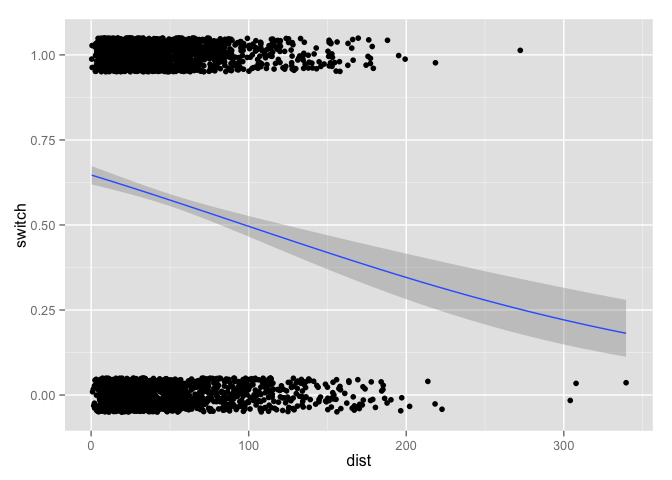
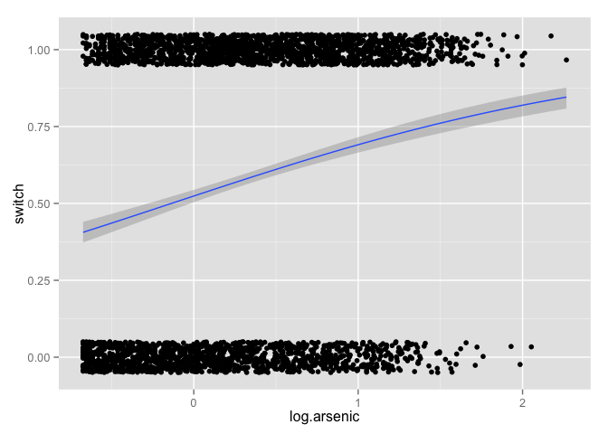

# Chapter 5, Problem 10 (Gelman & Hill)
Gianluca Rossi  
3 December 2015  

*Model building and comparison: continue with the well-switching data described in the previous exercise.*


```r
require(arm)
require(ggplot2)
require(foreign)
```


```r
df <- read.table("http://www.stat.columbia.edu/~gelman/arm/examples/arsenic/wells.dat")
summary(df)
```

```
##      switch          arsenic           dist             assoc       
##  Min.   :0.0000   Min.   :0.510   Min.   :  0.387   Min.   :0.0000  
##  1st Qu.:0.0000   1st Qu.:0.820   1st Qu.: 21.117   1st Qu.:0.0000  
##  Median :1.0000   Median :1.300   Median : 36.761   Median :0.0000  
##  Mean   :0.5752   Mean   :1.657   Mean   : 48.332   Mean   :0.4228  
##  3rd Qu.:1.0000   3rd Qu.:2.200   3rd Qu.: 64.041   3rd Qu.:1.0000  
##  Max.   :1.0000   Max.   :9.650   Max.   :339.531   Max.   :1.0000  
##       educ       
##  Min.   : 0.000  
##  1st Qu.: 0.000  
##  Median : 5.000  
##  Mean   : 4.828  
##  3rd Qu.: 8.000  
##  Max.   :17.000
```

### Part A

*Fit a logistic regression for the probability of switching using, as predictors, distance, log(arsenic), and their interaction. Interpret the estimated coefficients and their standard errors.*


```r
df$log.arsenic <- log(df$arsenic)
m1 <- glm(switch ~ dist * log.arsenic, family=binomial(link="logit"), data=df)
display(m1)
```

```
## glm(formula = switch ~ dist * log.arsenic, family = binomial(link = "logit"), 
##     data = df)
##                  coef.est coef.se
## (Intercept)       0.49     0.07  
## dist             -0.01     0.00  
## log.arsenic       0.98     0.11  
## dist:log.arsenic  0.00     0.00  
## ---
##   n = 3020, k = 4
##   residual deviance = 3896.8, null deviance = 4118.1 (difference = 221.3)
```

* `Intercept`: a person with an average distance from a well with clean water and average `log.arsenic` has a $logit^{-1}(0.49) = 62.01\%$ probability to switch well
* `dist`: a one meter increase in distance from a well with safe water, holding all other predictors to their mean, has the effect of decreasing the probability of switch well by $\frac{-0.01}{4} = -0.25\%$. Using a more reasonable scale, this is equivalent to say that every 10 meters increase in distance the probability to switch decreases by 2.5%
* `log.arsenic`: all other predictors hold at their mean, we can say that a 10% increase in `arsenic` corresponds  in a difference in the expected probability of switching well of $\beta_{log.arsenic} * log(\frac{r2}{r1}) = 0.98 * log(\frac{0.3138608*1.1}{0.3138608}) = 9.34\%$. The choice of 0.3138608 as a value to plug into the formulat is due to the fact that is the average value of `log.arsenic` as you can see using the following command


```r
mean(df$log.arsenic)
```

```
## [1] 0.3138608
```

* `dist:log.arsenic`: the coefficient for the interaction term is zero and also not significant (p-value 0.206). We might want to exclude it the next time we fit the model 


### Part B

*Make graphs as in Figure 5.12 to show the relation between probability of switching, distance, and arsenic level.*


```r
ggplot(data=df, aes(x=dist, y=switch)) +
  geom_jitter(position=position_jitter(height=.05)) + 
  geom_smooth(method="glm", family="binomial")
```

 

```r
ggplot(data=df, aes(x=log.arsenic, y=switch)) +
  geom_jitter(position=position_jitter(height=.05)) + 
  geom_smooth(method="glm", family="binomial")
```

 

### Part C

*Following the procedure described in Section 5.7, compute the average pre- dictive differences corresponding to:*

i. *A comparison of dist = 0 to dist = 100, with arsenic held constant.*


```r
b <- coef(m1)
hi <- 100
lo <- 0
delta <- invlogit(b[1] + b[2]*hi + b[3]*df$log.arsenic +
                    b[4]*df$log.arsenic*hi) - 
  invlogit(b[1] + b[2]*lo + b[3]*df$log.arsenic + b[4]*df$log.arsenic*lo)
print(mean(delta))
```

```
## [1] -0.2113356
```

The result is -0.21, implying that, on average in the data, households that are 100 meters from the nearest safe well are 21% less likely to switch, compared to households that are right next to the nearest safe well, as the same arsenic and education levels.

ii. *A comparison of dist = 100 to dist = 200, with arsenic held constant.*


```r
b <- coef(m1)
hi <- 200
lo <- 100
delta <- invlogit(b[1] + b[2]*hi + b[3]*df$log.arsenic +
                    b[4]*df$log.arsenic*hi) - 
  invlogit(b[1] + b[2]*lo + b[3]*df$log.arsenic + b[4]*df$log.arsenic*lo)
print(mean(delta))
```

```
## [1] -0.2090207
```

We obtain pretty much the same results, meaning that the cost function of additional 100 meters distance from the nearest safe well drives the same amount of perceived cost than from 0 to 100 meters.

iii. *A comparison of arsenic = 0.5 to arsenic = 1.0, with dist held constant.* 


```r
b <- coef(m1)
hi <- 1.0
lo <- 0.5
delta <- invlogit(b[1] + b[2]*df$dist + b[3]*hi +
                    b[4]*df$dist*hi) - 
  invlogit(b[1] + b[2]*df$dist + b[3]*lo + b[4]*df$dist*lo)
print(mean(delta))
```

```
## [1] 0.09195206
```

The result is 0.09, so this comparison corresponds to a 9% difference in probability of switching.

iv. *A comparison of arsenic = 1.0 to arsenic = 2.0, with dist held constant. Discuss these results.*


```r
b <- coef(m1)
hi <- 2.0
lo <- 1.0
delta <- invlogit(b[1] + b[2]*df$dist + b[3]*hi +
                    b[4]*df$dist*hi) - 
  invlogit(b[1] + b[2]*df$dist + b[3]*lo + b[4]*df$dist*lo)
print(mean(delta))
```

```
## [1] 0.1353431
```

The result is 0.14, so this comparison corresponds to a 14% difference in probability of switching.
