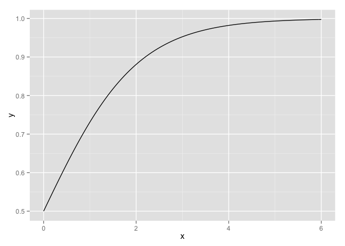
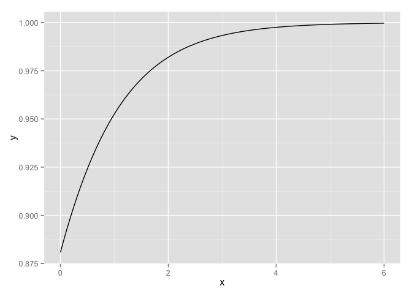
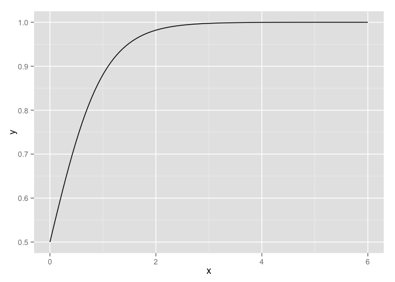
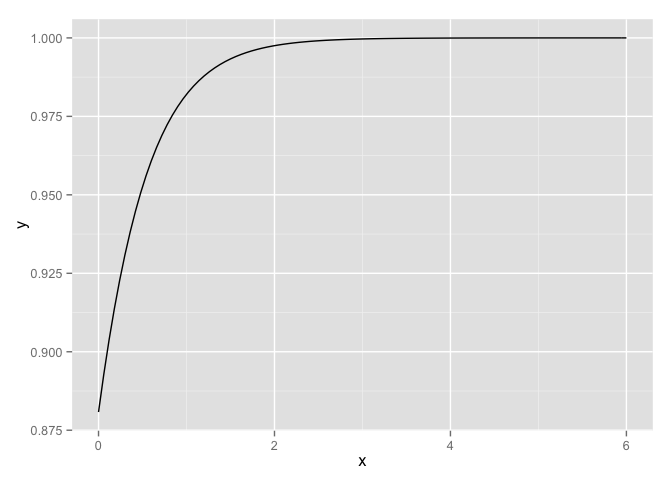
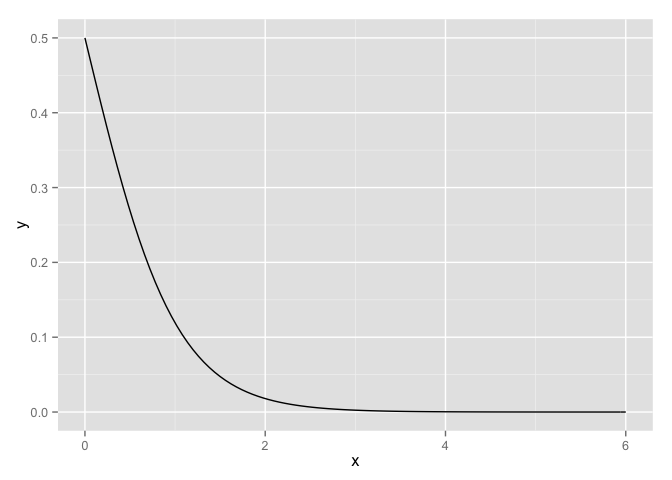

# Chapter 5, Problem 2 (Gelman & Hill)
Gianluca Rossi  
15 November 2015  

*Without using a computer, sketch the following logistic regression lines:*

Even though the exercise explicitly states you should not use a computer, you can use the following plots to verify your solutions.


```r
require(ggplot2)
require(arm)
```

### Part A

*$Pr(y = 1) = logit^{−1}(x)$*


```r
ggplot(data.frame(x=c(0, 6)), aes(x)) + 
    stat_function(fun=function(x) invlogit(x))
```

 

In this case you can notice how the y-intercept is $logit^{-1}(0) = 0.5$.


### Part B

*$Pr(y = 1) = logit^{−1}(2 + x)$*


```r
ggplot(data.frame(x=c(0, 6)), aes(x)) + 
    stat_function(fun=function(x) invlogit(2+x))
```

 

In this case the y-intercept is $logit^{-1}(2) = 0.88079$.


### Part C

*$Pr(y = 1) = logit^{−1}(2x)$*


```r
ggplot(data.frame(x=c(0, 6)), aes(x)) + 
    stat_function(fun=function(x) invlogit(2*x))
```

 

In this example the y-intercept is 0.5 (because $2 * 0 = 0$, thus $logit^{-1}(0) = 0.5$).


### Part D

*$Pr(y = 1) = logit^{−1}(2 + 2x)$*


```r
ggplot(data.frame(x=c(0, 6)), aes(x)) + 
    stat_function(fun=function(x) invlogit(2 + 2*x))
```

 

This has a y-intercept of $logit^{-1}(2) = 0.88079$

### Part E

*$Pr(y = 1) = logit^{−1}(−2x)$*


```r
ggplot(data.frame(x=c(0, 6)), aes(x)) + 
    stat_function(fun=function(x) invlogit(-2*x))
```

 

In this case the slope is negative because and the y-intercept is $logit^{-1}(0) = 0.5$. 
