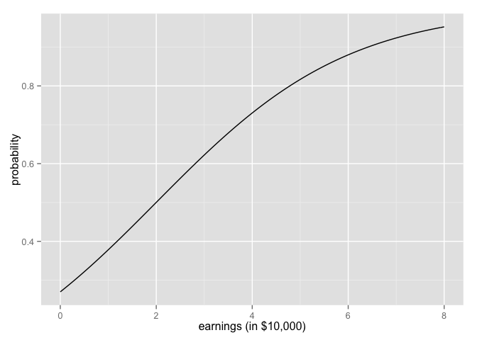

# Chapter 5, Problem 3 (Gelman & Hill)
Gianluca Rossi  
15 November 2015  

*You are interested in how well the combined earnings of the parents in a child’s family predicts high school graduation. You are told that the probability a child graduates from high school is 27% for children whose parents earn no income and is 88% for children whose parents earn $60,000. Determine the logistic regression model that is consistent with this information. (For simplicity you may want to assume that income is measured in units of $10,000).*

We can find the y-intercept solving the equation $logit(0.27) = -0.9946$. On the same way, we can find the coefficient for the earnings:

$$logit(0.88) = -0.9946 + x*6$$
$$1.9924301646902063 = -0.9946 + x*6$$
$$x = \frac{1.9924301646902063 + 0.9946}{6} = 0.4978$$

This lead us to the final equation:
$$Pr(y=1) = logit^{-1}(-0.9946 + 0.4978*x)$$


```r
require(ggplot2)
require(arm)
```

Plotting the equation, we obtain this:


```r
ggplot(data.frame(x=c(0, 8)), aes(x)) + 
    stat_function(fun=function(x) invlogit(-0.9946 + 0.4978 * x)) + 
  labs(x="earnings (in $10,000)", y="probability")
```

 
