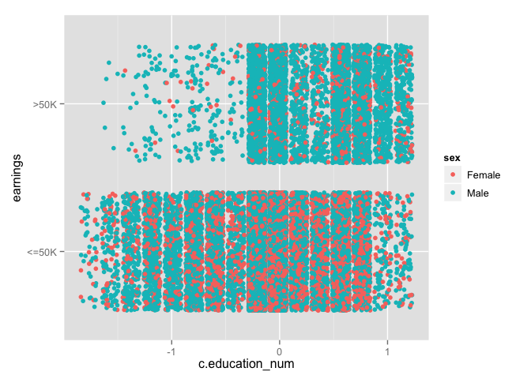
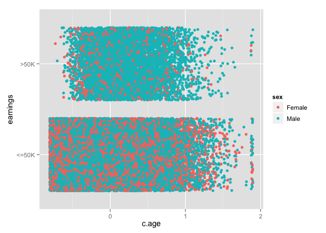
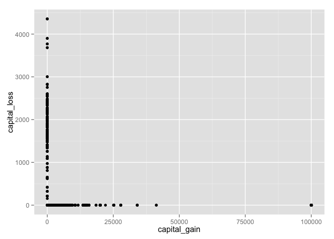
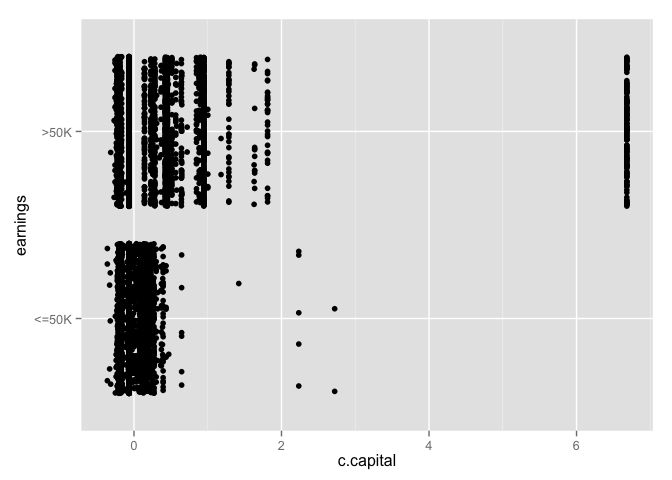
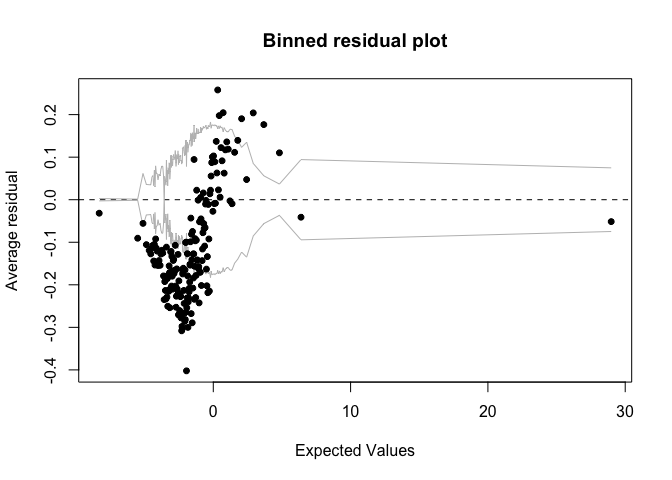
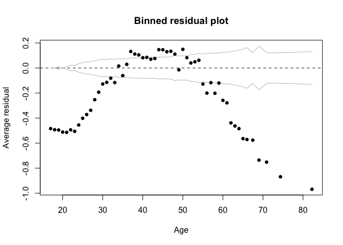
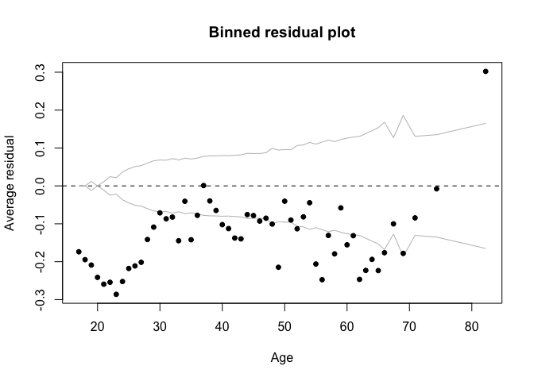

# Chapter 5, Problem 4 (Gelman & Hill)
Gianluca Rossi  
15 November 2015  

*Perform a logistic regression for a problem of interest to you. This can be from a research project, a previous class, or data you download. Choose one variable of interest to be the outcome, which will take on the values 0 and 1 (since you are doing logistic regression).*

We use the great resource that is the [UCI Machine Learning Repository](http://archive.ics.uci.edu/ml/) to find an interesting dataset to explore for this exercise. The dataset we chose is the ["Adult"](http://archive.ics.uci.edu/ml/datasets/Adult) dataset, which was built to predict whether income exceeds $50K/yr based on census data. Also known as "Census Income" dataset.


```r
require(arm)
require(foreign)
require(ggplot2)
require(boot)
```


```r
df <- read.table("http://archive.ics.uci.edu/ml/machine-learning-databases/adult/adult.data", stringsAsFactors=TRUE, sep=",")

# set column names
colNames <- c("age", "workclass", "fnlwgt", "education", "education_num", "marital_status", "occupation", "relationship", "race", "sex", "capital_gain", "capital_loss", "hours_per_week", "native_country", "earnings")
colnames(df) <- colNames

# return column types
str(df)
```

```
## 'data.frame':	32561 obs. of  15 variables:
##  $ age           : int  39 50 38 53 28 37 49 52 31 42 ...
##  $ workclass     : Factor w/ 9 levels " ?"," Federal-gov",..: 8 7 5 5 5 5 5 7 5 5 ...
##  $ fnlwgt        : int  77516 83311 215646 234721 338409 284582 160187 209642 45781 159449 ...
##  $ education     : Factor w/ 16 levels " 10th"," 11th",..: 10 10 12 2 10 13 7 12 13 10 ...
##  $ education_num : int  13 13 9 7 13 14 5 9 14 13 ...
##  $ marital_status: Factor w/ 7 levels " Divorced"," Married-AF-spouse",..: 5 3 1 3 3 3 4 3 5 3 ...
##  $ occupation    : Factor w/ 15 levels " ?"," Adm-clerical",..: 2 5 7 7 11 5 9 5 11 5 ...
##  $ relationship  : Factor w/ 6 levels " Husband"," Not-in-family",..: 2 1 2 1 6 6 2 1 2 1 ...
##  $ race          : Factor w/ 5 levels " Amer-Indian-Eskimo",..: 5 5 5 3 3 5 3 5 5 5 ...
##  $ sex           : Factor w/ 2 levels " Female"," Male": 2 2 2 2 1 1 1 2 1 2 ...
##  $ capital_gain  : int  2174 0 0 0 0 0 0 0 14084 5178 ...
##  $ capital_loss  : int  0 0 0 0 0 0 0 0 0 0 ...
##  $ hours_per_week: int  40 13 40 40 40 40 16 45 50 40 ...
##  $ native_country: Factor w/ 42 levels " ?"," Cambodia",..: 40 40 40 40 6 40 24 40 40 40 ...
##  $ earnings      : Factor w/ 2 levels " <=50K"," >50K": 1 1 1 1 1 1 1 2 2 2 ...
```

Before diving into the data analysis, we need to clean a bit the dataset. As you can see from the output of `str()`, some of the variables are not formatted in the correct way. We also took the occasion to centre and normalise all numerical variables. This is a useful transformation in order to more easily compare the magnitude of each predictor in our model.


```r
# cast a few variables as numeric
df$age <- as.numeric(df$age)
df$fnlwgt <- as.numeric(df$fnlwgt)
df$education_num <- as.numeric(df$education_num)
df$capital_gain <- as.numeric(df$capital_gain)
df$capital_loss <- as.numeric(df$capital_loss)
df$hours_per_week <- as.numeric(df$hours_per_week)

# centre and normalise non factor variables
df$c.age <- (df$age - mean(df$age, na.rm=TRUE)) / (2 * sd(df$age, na.rm=TRUE))
df$c.fnlwgt <- (df$fnlwgt - mean(df$fnlwgt, na.rm=TRUE)) / (2 * sd(df$fnlwgt, na.rm=TRUE))
df$c.education_num <- (df$education_num - mean(df$education_num, na.rm=TRUE)) / (2 * sd(df$education_num, na.rm=TRUE))
df$c.capital_gain <- (df$capital_gain - mean(df$capital_gain, na.rm=TRUE)) / (2 * sd(df$capital_gain, na.rm=TRUE))
df$c.capital_loss <- (df$capital_loss - mean(df$capital_loss, na.rm=TRUE)) / (2 * sd(df$capital_loss, na.rm=TRUE))
df$c.hours_per_week <- (df$hours_per_week - mean(df$hours_per_week, na.rm=TRUE)) / (2 * sd(df$hours_per_week, na.rm=TRUE))

# return summary statistics for all columns
summary(df)
```

```
##       age                    workclass         fnlwgt       
##  Min.   :17.00    Private         :22696   Min.   :  12285  
##  1st Qu.:28.00    Self-emp-not-inc: 2541   1st Qu.: 117827  
##  Median :37.00    Local-gov       : 2093   Median : 178356  
##  Mean   :38.58    ?               : 1836   Mean   : 189778  
##  3rd Qu.:48.00    State-gov       : 1298   3rd Qu.: 237051  
##  Max.   :90.00    Self-emp-inc    : 1116   Max.   :1484705  
##                  (Other)          :  981                    
##          education     education_num                  marital_status 
##   HS-grad     :10501   Min.   : 1.00    Divorced             : 4443  
##   Some-college: 7291   1st Qu.: 9.00    Married-AF-spouse    :   23  
##   Bachelors   : 5355   Median :10.00    Married-civ-spouse   :14976  
##   Masters     : 1723   Mean   :10.08    Married-spouse-absent:  418  
##   Assoc-voc   : 1382   3rd Qu.:12.00    Never-married        :10683  
##   11th        : 1175   Max.   :16.00    Separated            : 1025  
##  (Other)      : 5134                    Widowed              :  993  
##             occupation            relationship  
##   Prof-specialty :4140    Husband       :13193  
##   Craft-repair   :4099    Not-in-family : 8305  
##   Exec-managerial:4066    Other-relative:  981  
##   Adm-clerical   :3770    Own-child     : 5068  
##   Sales          :3650    Unmarried     : 3446  
##   Other-service  :3295    Wife          : 1568  
##  (Other)         :9541                          
##                   race            sex         capital_gain  
##   Amer-Indian-Eskimo:  311    Female:10771   Min.   :    0  
##   Asian-Pac-Islander: 1039    Male  :21790   1st Qu.:    0  
##   Black             : 3124                   Median :    0  
##   Other             :  271                   Mean   : 1078  
##   White             :27816                   3rd Qu.:    0  
##                                              Max.   :99999  
##                                                             
##   capital_loss    hours_per_week         native_country    earnings    
##  Min.   :   0.0   Min.   : 1.00    United-States:29170    <=50K:24720  
##  1st Qu.:   0.0   1st Qu.:40.00    Mexico       :  643    >50K : 7841  
##  Median :   0.0   Median :40.00    ?            :  583                 
##  Mean   :  87.3   Mean   :40.44    Philippines  :  198                 
##  3rd Qu.:   0.0   3rd Qu.:45.00    Germany      :  137                 
##  Max.   :4356.0   Max.   :99.00    Canada       :  121                 
##                                   (Other)       : 1709                 
##      c.age             c.fnlwgt        c.education_num   
##  Min.   :-0.79109   Min.   :-0.84080   Min.   :-1.76480  
##  1st Qu.:-0.38788   1st Qu.:-0.34084   1st Qu.:-0.21003  
##  Median :-0.05798   Median :-0.05411   Median :-0.01568  
##  Mean   : 0.00000   Mean   : 0.00000   Mean   : 0.00000  
##  3rd Qu.: 0.34524   3rd Qu.: 0.22393   3rd Qu.: 0.37301  
##  Max.   : 1.88478   Max.   : 6.13419   Max.   : 1.15040  
##                                                          
##  c.capital_gain     c.capital_loss    c.hours_per_week  
##  Min.   :-0.07296   Min.   :-0.1083   Min.   :-1.59699  
##  1st Qu.:-0.07296   1st Qu.:-0.1083   1st Qu.:-0.01771  
##  Median :-0.07296   Median :-0.1083   Median :-0.01771  
##  Mean   : 0.00000   Mean   : 0.0000   Mean   : 0.00000  
##  3rd Qu.:-0.07296   3rd Qu.:-0.1083   3rd Qu.: 0.18476  
##  Max.   : 6.69719   Max.   : 5.2967   Max.   : 2.37145  
## 
```


### Part A

*Analyze the data in R. Use the display() function to summarize the results.*

We wan't to predict whether a subject earns more than $50K/yr, based on some census data. Being the first time we are exposed to this dataset we will run a quick exploratory analysis to get a better understanding of the problem at hand.


```r
ggplot(data=df, aes(x=c.education_num, y=earnings, col=sex)) + geom_point(position="jitter")
```

 

As expected higher levels of education are generally associated with higher incomes. However, this seems to be more the case for males than females. Interestingly, this latter intuition didn't made it into the final model. The interaction `sex:c.education_num` was in fact not statistically significant, probably due to the inclusion of other predictors which already explained part of that variance.


```r
ggplot(data=df, aes(x=c.age, y=earnings, col=sex)) + geom_point(position="jitter")
```

 

From the graph above we notice two things immediately:

* Subjects earning more than $50K/yr are more often men
* We might want to include also the square root of `c.age` into our model; individuals earning more than $50K/yr are more centered around 0 then the rest of the population
* The interraction between `c.age` and `sex` seems to capture some signal

We need also to transform the variable `c.capital_gain`, because it perfectly separates zeroes and ones in the outcome variable. One transformation we will try is to merge the two variables into a unique variable named `capital`, which we will then centre and normalise.


```r
# make sure there are not observations where capital gain and capital losses are both positive 
nrow(summary(df[df$capital_gain > 0,]$capital_loss))
```

```
## NULL
```

```r
nrow(summary(df[df$capital_loss > 0,]$capital_gain))
```

```
## NULL
```

```r
# there are very high outliers among those subjects with earning greater than $50K/yr, we believe those are actually wrong measurements thus we decided to remove them from the training set
ggplot(data=df, aes(x=capital_gain, y=earnings)) + geom_point(position="jitter")
```

 

```r
ggplot(data=df, aes(x=capital_loss, y=earnings)) + geom_point(position="jitter")
```

 

```r
df <- df[df$capital_gain < 50000, ]

# create predictor which includes both `capital_gain` and `capital_loss`
df$capital <- ifelse(df$capital_gain==0, -df$capital_loss, df$capital_gain)
df$c.capital <- (df$capital - mean(df$capital, na.rm=TRUE)) / (2 * sd(df$capital, na.rm=TRUE))
summary(df$capital)
```

```
##    Min. 1st Qu.  Median    Mean 3rd Qu.    Max. 
## -4356.0     0.0     0.0   504.5     0.0 41310.0
```

```r
summary(df$c.capital)
```

```
##     Min.  1st Qu.   Median     Mean  3rd Qu.     Max. 
## -0.93050 -0.09658 -0.09658  0.00000 -0.09658  7.81100
```

Our initial model is defined as follow:


```r
m1 <- glm(earnings ~ sex + c.age + c.education_num + workclass + occupation + c.capital, data=df, family=binomial(link="logit"))
display(m1)
```

```
## glm(formula = earnings ~ sex + c.age + c.education_num + workclass + 
##     occupation + c.capital, family = binomial(link = "logit"), 
##     data = df)
##                              coef.est coef.se
## (Intercept)                   -3.45     0.10 
## sex Male                       1.29     0.04 
## c.age                          1.11     0.03 
## c.education_num                1.41     0.04 
## workclass Federal-gov          1.39     0.14 
## workclass Local-gov            0.90     0.13 
## workclass Never-worked        -9.64   193.74 
## workclass Private              1.01     0.11 
## workclass Self-emp-inc         1.51     0.13 
## workclass Self-emp-not-inc     0.73     0.12 
## workclass State-gov            0.66     0.14 
## workclass Without-pay        -10.90   129.07 
## occupation Adm-clerical       -0.15     0.09 
## occupation Armed-Forces       -0.95     1.09 
## occupation Craft-repair        0.11     0.08 
## occupation Exec-managerial     0.84     0.08 
## occupation Farming-fishing    -0.82     0.13 
## occupation Handlers-cleaners  -0.98     0.14 
## occupation Machine-op-inspct  -0.26     0.10 
## occupation Other-service      -1.20     0.11 
## occupation Priv-house-serv    -3.74     1.38 
## occupation Prof-specialty      0.48     0.08 
## occupation Protective-serv     0.51     0.12 
## occupation Sales               0.24     0.08 
## occupation Tech-support        0.45     0.11 
## c.capital                      1.23     0.04 
## ---
##   n = 32402, k = 26
##   residual deviance = 25744.6, null deviance = 35492.9 (difference = 9748.3)
```

```r
binnedplot(predict(m1), resid(m1))
```

 

### Part B

*Fit several different versions of your model. Try including different predictors, interactions, and transformations of the inputs.*

We will now start adding a few interaction terms which we believe can be of interest: `sex:c.age` and `c.education_num:sex`. To our suprise only the first turns out to be significant. 


```r
m2 <- glm(earnings ~ sex * c.age + c.education_num * sex + workclass + occupation + c.capital, data=df, family=binomial(link="logit"))
display(m2)
```

```
## glm(formula = earnings ~ sex * c.age + c.education_num * sex + 
##     workclass + occupation + c.capital, family = binomial(link = "logit"), 
##     data = df)
##                              coef.est coef.se
## (Intercept)                   -3.44     0.10 
## sex Male                       1.26     0.05 
## c.age                          0.82     0.07 
## c.education_num                1.43     0.09 
## workclass Federal-gov          1.40     0.14 
## workclass Local-gov            0.92     0.13 
## workclass Never-worked        -9.58   193.90 
## workclass Private              1.02     0.11 
## workclass Self-emp-inc         1.52     0.14 
## workclass Self-emp-not-inc     0.73     0.12 
## workclass State-gov            0.67     0.14 
## workclass Without-pay        -10.89   126.96 
## occupation Adm-clerical       -0.14     0.09 
## occupation Armed-Forces       -0.92     1.09 
## occupation Craft-repair        0.11     0.08 
## occupation Exec-managerial     0.84     0.08 
## occupation Farming-fishing    -0.83     0.13 
## occupation Handlers-cleaners  -0.97     0.14 
## occupation Machine-op-inspct  -0.25     0.10 
## occupation Other-service      -1.19     0.12 
## occupation Priv-house-serv    -3.67     1.39 
## occupation Prof-specialty      0.48     0.08 
## occupation Protective-serv     0.51     0.12 
## occupation Sales               0.24     0.08 
## occupation Tech-support        0.45     0.11 
## c.capital                      1.23     0.04 
## sex Male:c.age                 0.38     0.08 
## sex Male:c.education_num      -0.02     0.09 
## ---
##   n = 32402, k = 28
##   residual deviance = 25722.3, null deviance = 35492.9 (difference = 9770.6)
```

We can notice how removing `sex:education_num` from our previous model specification didn't lead to any deviance difference increase. This confirms the interaction wasn't capturing any real signal.


```r
m3 <- glm(earnings ~ sex * c.age + c.education_num + workclass + occupation + c.capital, data=df, family=binomial(link="logit"))
display(m3)
```

```
## glm(formula = earnings ~ sex * c.age + c.education_num + workclass + 
##     occupation + c.capital, family = binomial(link = "logit"), 
##     data = df)
##                              coef.est coef.se
## (Intercept)                   -3.44     0.10 
## sex Male                       1.25     0.04 
## c.age                          0.82     0.07 
## c.education_num                1.41     0.04 
## workclass Federal-gov          1.41     0.14 
## workclass Local-gov            0.92     0.13 
## workclass Never-worked        -9.59   195.34 
## workclass Private              1.02     0.11 
## workclass Self-emp-inc         1.52     0.14 
## workclass Self-emp-not-inc     0.74     0.12 
## workclass State-gov            0.68     0.14 
## workclass Without-pay        -10.86   125.52 
## occupation Adm-clerical       -0.14     0.09 
## occupation Armed-Forces       -0.92     1.10 
## occupation Craft-repair        0.11     0.08 
## occupation Exec-managerial     0.84     0.08 
## occupation Farming-fishing    -0.83     0.13 
## occupation Handlers-cleaners  -0.97     0.14 
## occupation Machine-op-inspct  -0.25     0.10 
## occupation Other-service      -1.20     0.11 
## occupation Priv-house-serv    -3.68     1.39 
## occupation Prof-specialty      0.48     0.08 
## occupation Protective-serv     0.50     0.12 
## occupation Sales               0.24     0.08 
## occupation Tech-support        0.45     0.11 
## c.capital                      1.23     0.04 
## sex Male:c.age                 0.38     0.08 
## ---
##   n = 32402, k = 27
##   residual deviance = 25722.4, null deviance = 35492.9 (difference = 9770.5)
```

We then added an additional transformation to our model. We took the `c.age` squared. This decision was taken looking at the following two graphs.


```r
# there is a curvilinear trend we might want to capture in the `c.age` residuals 
v1 <- glm(earnings ~ c.age, data=df, family=binomial(link="logit"))
display(v1)
```

```
## glm(formula = earnings ~ c.age, family = binomial(link = "logit"), 
##     data = df)
##             coef.est coef.se
## (Intercept) -1.24     0.01  
## c.age        1.07     0.03  
## ---
##   n = 32402, k = 2
##   residual deviance = 33795.9, null deviance = 35492.9 (difference = 1697.0)
```

```r
binnedplot(df$age, resid(v1), xlab="Age")
```

 

```r
# adding a squared term capture a great part of that variance
v2 <- glm(earnings ~ c.age + I(c.age^2), data=df,  family=binomial(link="logit"))
display(v2)
```

```
## glm(formula = earnings ~ c.age + I(c.age^2), family = binomial(link = "logit"), 
##     data = df)
##             coef.est coef.se
## (Intercept) -0.81     0.02  
## c.age        2.22     0.04  
## I(c.age^2)  -2.58     0.07  
## ---
##   n = 32402, k = 3
##   residual deviance = 31541.1, null deviance = 35492.9 (difference = 3951.8)
```

```r
binnedplot(df$age, resid(v2), xlab="Age")
```

 

As you can see the residuals of a model using `c.age` as its only predictor, has curvilinear residuals that we could minimise adding a squared term into the model. Doing it, we will increase furthermore the difference between null diviance and residual deviance. 


```r
m4 <- glm(earnings ~ sex * c.age + I(c.age^2) + c.education_num + workclass + occupation + c.capital, data=df, family=binomial(link="logit"))
display(m4)
```

```
## glm(formula = earnings ~ sex * c.age + I(c.age^2) + c.education_num + 
##     workclass + occupation + c.capital, family = binomial(link = "logit"), 
##     data = df)
##                              coef.est coef.se
## (Intercept)                   -2.40     0.10 
## sex Male                       1.21     0.04 
## c.age                          1.65     0.09 
## I(c.age^2)                    -2.39     0.08 
## c.education_num                1.31     0.04 
## workclass Federal-gov          0.58     0.14 
## workclass Local-gov            0.12     0.13 
## workclass Never-worked        -8.94   192.60 
## workclass Private              0.32     0.12 
## workclass Self-emp-inc         0.78     0.14 
## workclass Self-emp-not-inc     0.02     0.13 
## workclass State-gov           -0.09     0.14 
## workclass Without-pay        -10.79   124.69 
## occupation Adm-clerical       -0.01     0.09 
## occupation Armed-Forces       -0.58     1.15 
## occupation Craft-repair        0.09     0.08 
## occupation Exec-managerial     0.90     0.08 
## occupation Farming-fishing    -0.70     0.13 
## occupation Handlers-cleaners  -0.78     0.14 
## occupation Machine-op-inspct  -0.26     0.10 
## occupation Other-service      -1.00     0.12 
## occupation Priv-house-serv    -3.62     1.57 
## occupation Prof-specialty      0.60     0.09 
## occupation Protective-serv     0.66     0.12 
## occupation Sales               0.39     0.08 
## occupation Tech-support        0.54     0.11 
## c.capital                      1.24     0.04 
## sex Male:c.age                 0.66     0.10 
## ---
##   n = 32402, k = 28
##   residual deviance = 24481.1, null deviance = 35492.9 (difference = 11011.7)
```

### Part C

*Choose one particular formulation of the model and do the following:*

i. *Describe how each input affects Pr(y = 1) in the fitted model. You must consider the estimated coefficient, the range of the input values, and the nonlinear inverse-logit function.*
ii. *What is the error rate of the fitted model? What is the error rate of the null model?*
iii. *Look at the deviance of the fitted and null models. Does the improvement in fit seem to be real?*
iv. *Use the model to make predictions for some test cases of interest.*

Out final model is formulated as follow.


```r
m5 <- glm(earnings ~ sex * c.age + I(c.age^2) + c.education_num + occupation + c.capital, data=df, family=binomial(link="logit"))
display(m5)
```

```
## glm(formula = earnings ~ sex * c.age + I(c.age^2) + c.education_num + 
##     occupation + c.capital, family = binomial(link = "logit"), 
##     data = df)
##                              coef.est coef.se
## (Intercept)                  -2.41     0.10  
## sex Male                      1.22     0.04  
## c.age                         1.63     0.09  
## I(c.age^2)                   -2.39     0.08  
## c.education_num               1.30     0.04  
## occupation Adm-clerical       0.31     0.11  
## occupation Armed-Forces      -0.01     1.15  
## occupation Craft-repair       0.37     0.10  
## occupation Exec-managerial    1.22     0.10  
## occupation Farming-fishing   -0.52     0.14  
## occupation Handlers-cleaners -0.48     0.15  
## occupation Machine-op-inspct  0.05     0.12  
## occupation Other-service     -0.72     0.13  
## occupation Priv-house-serv   -3.30     1.57  
## occupation Prof-specialty     0.85     0.10  
## occupation Protective-serv    0.82     0.13  
## occupation Sales              0.72     0.10  
## occupation Tech-support       0.84     0.12  
## occupation Transport-moving   0.27     0.11  
## c.capital                     1.24     0.04  
## sex Male:c.age                0.67     0.10  
## ---
##   n = 32402, k = 21
##   residual deviance = 24597.5, null deviance = 35492.9 (difference = 10895.3)
```

Removing `workclass` from our final model specification slightly reduced the residual difference but made for a more interpretable model. The main reason why we opted for removing that variable is that more of the levels were not statistically significant and had extremely high standard errrors. We found this last formuation much more robust.

Our final model coefficients can be explained as follows:

* `Intercept`: the probability of a female individual of average age and education, employed as ???? and average capital gain is $logit^{-1}(-2.41) = 0.0824 = 8.24\%$
* `sex`: this is the coefficient for sex (on the logit scale) is any other predictor is at its average value (or level 0 if a factor). To quickly interpret this on the probability scale, we divide by 4: $\frac{1.22}{4} = 0.305 = 30.50\%$. Thus, at the mean level of any other predictor in the data, a male individual has an approximate 30% increase in probability of earning more than $50K/yr
* `c.age`: to quickly interpret the coefficient in the probability scale, we divide by 4: $\frac{1.63}{4} = 0.4075 = 40.75%$. Thus, at the mean level of any other predictor (or level 0 if a factor), each standard deviation increase in c.age, which roughtly corresponds to ???, there is a 40.75% increase in probability to earn more than $50K/yr. We should however notice how it's not realistic to speak about holding every other predictor to its mean, because `c.age` and `c.age^2` will necessary be linked
* `c.age^2`: this transformation has made necessary to capture the trends at the more extreme part of the age distribution tales. To quickly interpret this coefficient in the probability scale, we divive by 4: $\frac{-2.39}{4} = -0.5975 = -59.75\%$. Holding at their average every other predictor, each additional standard deviation increase in `c.age^2` corresponds to an approximate 59.75% decrease in probability to earn more than $50K/yr. We should however notice how it's not realistic to speak about holding every other predictor to its mean, because `c.age` and `c.age^2` will necessary be linked
* `c.education_num`: this is the coefficient for education (in the logit scale) if any other predictor is hold at its average. To quickly interpret this on the probability scale, we divide it by 4: $\frac{1.30}{4} = 0.325 = 32.50\%$. Thus, at the mean level of any other predictor, each standard deviation increase in `c.education` corresponds to an approximate 32.50% increase in probability to earn more than $50K/yr
* `occupation`: the base level for occupation is "unknown". Each coefficient, divided by 4, will approximately corresponds to the difference in probability to earn more than $50K/yr for that specific category 
* `c.capital`: holding any other predictor at its average, a standard deviation increase in capital gains corresponds to a $\frac{1.24}{4} = 0.31 = 31%$ increase in probability to earn more than $50K/yr
* `sex:c.age`: if the individual is a male, this corresponds to an increase by 0.67 to the coefficient for age


```r
cost <- function(r, pi = 0) mean(abs(r-pi) > 0.5)
cv <- cv.glm(df, m5, cost, 10)

# return the cross-validated prediction error
cv$delta[2]
```

```
## [1] 0.173477
```

Using cross-validation we know that on around 17.38% of the case we predict the wrong response outcome. This is not a bad score considering the amount of time we spent on this exercise and the fact we are using a generalized linear model. Non linear models might be better suited for this kind of classification problem. 

We will now proceed to validate our final model on new data. We expect our error rate to be closer to the 17% we saw using cross-validation. The following code will download from the UCI Machine Learning Repository the test set, generate all the transformed variables we used in our model and then predict the outcome using the coefficients we obtained during the training on the new data. 


```r
test <- read.table("http://archive.ics.uci.edu/ml/machine-learning-databases/adult/adult.test", stringsAsFactors=TRUE, sep=",", skip=1)

# set column names
colNames <- c("age", "workclass", "fnlwgt", "education", "education_num", "marital_status", "occupation", "relationship", "race", "sex", "capital_gain", "capital_loss", "hours_per_week", "native_country", "earnings")
colnames(test) <- colNames

# cast a few variables as numeric
test$age <- as.numeric(test$age)
test$fnlwgt <- as.numeric(test$fnlwgt)
test$education_num <- as.numeric(test$education_num)
test$capital_gain <- as.numeric(test$capital_gain)
test$capital_loss <- as.numeric(test$capital_loss)
test$hours_per_week <- as.numeric(test$hours_per_week)

# centre and normalise non factor variables
test$c.age <- (test$age - mean(test$age, na.rm=TRUE)) / (2 * sd(test$age, na.rm=TRUE))
test$c.fnlwgt <- (test$fnlwgt - mean(test$fnlwgt, na.rm=TRUE)) / (2 * sd(test$fnlwgt, na.rm=TRUE))
test$c.education_num <- (test$education_num - mean(test$education_num, na.rm=TRUE)) / (2 * sd(test$education_num, na.rm=TRUE))
test$c.capital_gain <- (test$capital_gain - mean(test$capital_gain, na.rm=TRUE)) / (2 * sd(test$capital_gain, na.rm=TRUE))
test$c.capital_loss <- (test$capital_loss - mean(test$capital_loss, na.rm=TRUE)) / (2 * sd(test$capital_loss, na.rm=TRUE))
test$c.hours_per_week <- (test$hours_per_week - mean(test$hours_per_week, na.rm=TRUE)) / (2 * sd(test$hours_per_week, na.rm=TRUE))

# generate `c.capital` predictor 
test$capital <- ifelse(test$capital_gain==0, -test$capital_loss, test$capital_gain)
test$c.capital <- (test$capital - mean(test$capital, na.rm=TRUE)) / (2 * sd(test$capital, na.rm=TRUE))
```


```r
glm.probs <- predict(m5, newdata=test, type="response")

glm.pred = rep(" <=50K.", length(test$earnings))
glm.pred[glm.probs >= 0.5] = " >50K."
# confusion matrix
table(glm.pred, test$earnings)
```

```
##          
## glm.pred   <=50K.  >50K.
##    <=50K.   11659   2142
##    >50K.      776   1704
```

```r
# prediction error
1 - mean(glm.pred == test$earnings)
```

```
## [1] 0.1792273
```

Cross-validated prediction error and the prediction error we got making predictions on new data are extremely close. This is very promising because it means that our cross-validation procedure is reliable and can be used to test our models and tune some parameters.
