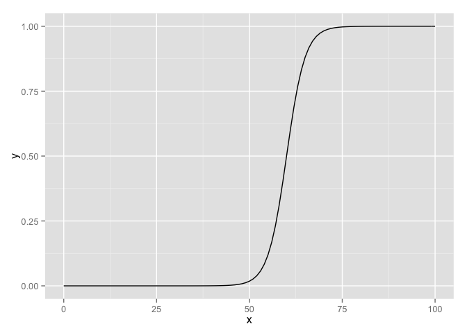
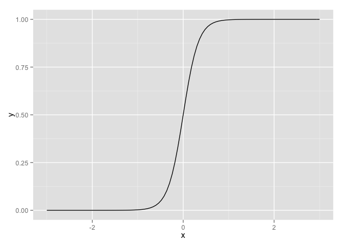

# Chapter 5, Problem 5 (Gelman & Hill)
Gianluca Rossi  
18 November 2015  

*In a class of 50 students, a logistic regression is performed of course grade (pass or fail) on midterm exam score (continuous values with mean 60 and standard deviation 15). The fitted model is $Pr(pass) = logit^{−1}(−24 + 0.4x)$.*


```r
require(ggplot2)
require(arm)
```

### Part A

*Graph the fitted model. Also on this graph put a scatterplot of hypothetical data consistent with the information given.*


```r
ggplot(data=data.frame(x=c(0,100)), aes(x=x)) + stat_function(fun=function(x) invlogit(-24 + 0.4*x))
```

 

### Part B

*Suppose the midterm scores were transformed to have a mean of 0 and standard deviation of 1. What would be the equation of the logistic regression using these transformed scores as a predictor?*


```r
ggplot(data=data.frame(x=c(-3,3)), aes(x=x)) + stat_function(fun=function(x) invlogit(-24*0 + (0.4*15)*x))
```

 

### Part C

*Create a new predictor that is pure noise (for example, in R you can create `newpred <- rnorm(n,0,1)`). Add it to your model. How much does the deviance decrease?*

Deviance should not decrease at all if the predictor is pure noise. 
