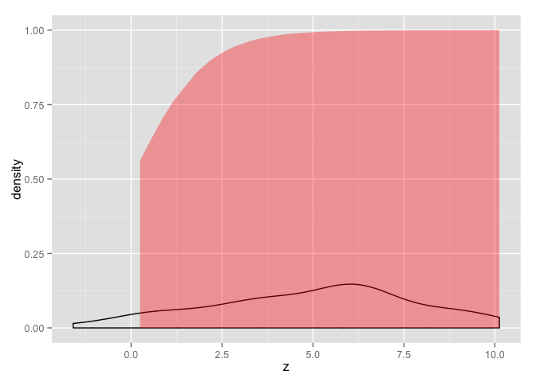

# Chapter 5, Problem 6 (Gelman & Hill)
Gianluca Rossi  
18 November 2015  

*Latent-data formulation of the logistic model: take the model $Pr(y = 1) = logit^{−1}(1 + 2 * x_{1} + 3 * x_{2})$ and consider a person for whom $x_{1} = 1$ and $x_{2} = 0.5$. Sketch the distribution of the latent data for this person. Figure out the probability that $y = 1$ for the person and shade the corresponding area on your graph.*


```r
require(ggplot2)
```

```
## Loading required package: ggplot2
```

```r
require(arm)
```

```
## Loading required package: arm
## Loading required package: MASS
## Loading required package: Matrix
## Loading required package: lme4
## 
## arm (Version 1.8-6, built: 2015-7-7)
## 
## Working directory is /Users/grossi/Dropbox/Code/ARM/ch5
```


```r
set.seed(12345)
epsilon <- rnorm(n=50, mean=0, sd=1.6^2)
x1 <- 1
x2 <- 0.5
z <- 1 + 2*x1 + 3*x2 + epsilon
z
```

```
##  [1]  5.9989538  6.3162330  4.2201835  3.3390472  6.0510719 -0.1539673
##  [7]  6.1130523  3.7929687  3.7725511  2.1465357  4.2024056  9.1523188
## [13]  5.4488073  5.8317541  2.5786381  6.5912636  2.2309247  3.6511614
## [19]  7.3690244  5.2647327  6.4958321  8.2268098  2.8505192  0.5239682
## [25]  0.4098636  9.1210496  3.2669827  6.0881723  6.0670361  4.0844839
## [31]  6.5783953 10.1238939  9.7459273  8.6790608  5.1509343  5.7574420
## [37]  3.6703384  0.2451514  9.0253987  4.5660507  7.3889877 -1.5937166
## [43]  1.7857202  6.8990798  6.6873964  8.2394673  0.8824671  5.9525523
## [49]  5.9929604  1.1545950
```

```r
ggplot(data=data.frame(z=z), aes(x=z)) + geom_density() +
  geom_ribbon(data=subset(data.frame(z=z), z>0), aes(ymax=invlogit(z)), ymin=0, fill="red", colour=NA, alpha=0.35)
```

 
