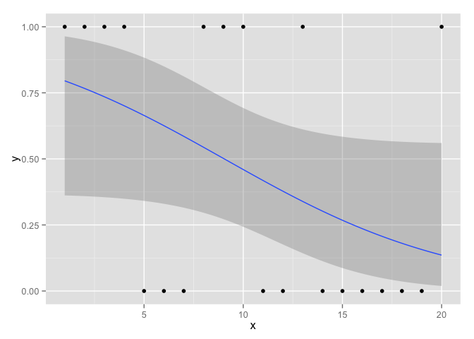

# Chapter 5, Problem 7 (Gelman & Hill)
Gianluca Rossi  
18 November 2015  

*Limitations of logistic regression: consider a dataset with n = 20 points, a single predictor x that takes on the values 1, . . . , 20, and binary data y. Construct data values y1, . . . , y20 that are inconsistent with any logistic regression on x. Fit a logistic regression to these data, plot the data and fitted curve, and explain why you can say that the model does not fit the data.*


```r
require(ggplot2)
require(arm)
```


```r
set.seed(12345)
y <- rbinom(n=20, size=1, prob=0.5)
x <- seq(1, 20, 1)
m1 <- glm(y ~ x, family=binomial(link="logit"))
display(m1)
```

```
## glm(formula = y ~ x, family = binomial(link = "logit"))
##             coef.est coef.se
## (Intercept)  1.53     1.07  
## x           -0.17     0.09  
## ---
##   n = 20, k = 2
##   residual deviance = 23.6, null deviance = 27.5 (difference = 3.9)
```

```r
ggplot(data=data.frame(cbind(y, x)), aes(x=x, y=y)) + geom_point() + stat_smooth(method = "glm", family = "binomial")
```

 

The model doesn't fit the data because:

1. The residual difference is very close to $k$
2. The outcome $y$ doesn't seem to be closely related to the predictor $x$ (which is in fact not, as you can see from the code) even though it is almost statistically significant at the 5% level
3. The wide 95% confidence interval also tells us we are not very confident on the estimated regression line curve
