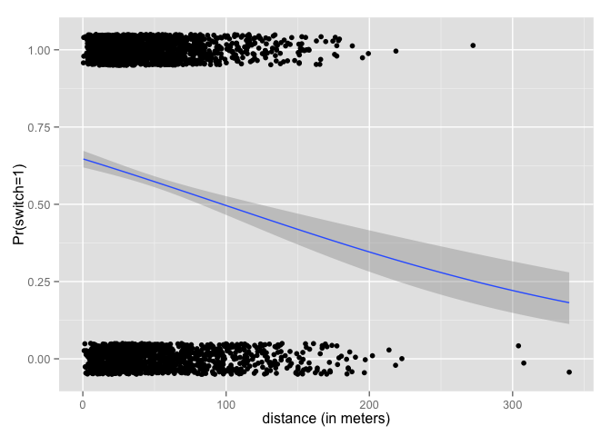
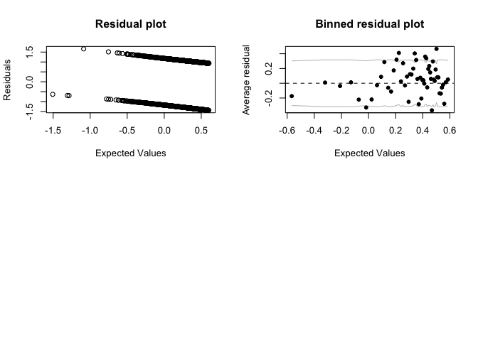

# Chapter 5, Problem 9 (Gelman & Hill)
Gianluca Rossi  
30 November 2015  

*Graphing logistic regressions: the well-switching data described in Section 5.4 are in the folder `arsenic`.*


```r
require(arm)
require(foreign)
require(ggplot2)
```


```r
df <- read.table("http://www.stat.columbia.edu/~gelman/arm/examples/arsenic/wells.dat")
summary(df)
```

```
##      switch          arsenic           dist             assoc       
##  Min.   :0.0000   Min.   :0.510   Min.   :  0.387   Min.   :0.0000  
##  1st Qu.:0.0000   1st Qu.:0.820   1st Qu.: 21.117   1st Qu.:0.0000  
##  Median :1.0000   Median :1.300   Median : 36.761   Median :0.0000  
##  Mean   :0.5752   Mean   :1.657   Mean   : 48.332   Mean   :0.4228  
##  3rd Qu.:1.0000   3rd Qu.:2.200   3rd Qu.: 64.041   3rd Qu.:1.0000  
##  Max.   :1.0000   Max.   :9.650   Max.   :339.531   Max.   :1.0000  
##       educ       
##  Min.   : 0.000  
##  1st Qu.: 0.000  
##  Median : 5.000  
##  Mean   : 4.828  
##  3rd Qu.: 8.000  
##  Max.   :17.000
```

### Part A

*Fit a logistic regression for the probability of switching using log (distance to nearest safe well) as a predictor.*


```r
m1 <- glm(switch ~ dist, data=df, family=binomial(link="logit"))
display(m1)
```

```
## glm(formula = switch ~ dist, family = binomial(link = "logit"), 
##     data = df)
##             coef.est coef.se
## (Intercept)  0.61     0.06  
## dist        -0.01     0.00  
## ---
##   n = 3020, k = 2
##   residual deviance = 4076.2, null deviance = 4118.1 (difference = 41.9)
```

### Part B

*Make a graph similar to Figure 5.9 displaying Pr(switch) as a function of distance to nearest safe well, along with the data.*


```r
ggplot(data=df, aes(x=dist, y=switch)) + geom_jitter(position = position_jitter(height=.05)) + stat_smooth(method="glm", family="binomial") + labs(x="distance (in meters)", y="Pr(switch=1)")
```

 

### Part C

*Make a residual plot and binned residual plot as in Figure 5.13.*


```r
par(mfrow=c(2,2))
plot(predict(m1),residuals(m1), main="Residual plot", xlab="Expected Values", ylab="Residuals")
binnedplot(predict(m1),residuals(m1))
```

 

### Part D

*Compute the error rate of the fitted model and compare to the error rate of the null model.*


```r
# error rate of fitted model
predicted <- predict(m1)
y <- df$switch
mean((predicted>0.5 & y==0) | (predicted<0.5 & y==1))
```

```
## [1] 0.542053
```

```r
# error rate of null model
predicted.null <- seq(0, 0, length.out=length(y))
mean((predicted.null>0.5 & y==0) | (predicted.null<0.5 & y==1))
```

```
## [1] 0.5751656
```

### Part E

*Create indicator variables corresponding to dist < 100, 100 ≤ dist < 200, and dist > 200. Fit a logistic regression for Pr(switch) using these indicators. With this new model, repeat the computations and graphs for part (a) of this exercise.*


```r
# create indicator variables for distance
df$dist_lt100 <- as.numeric(df$dist < 100)
df$dist_gte100_lt200 <- as.numeric(100 <= df$dist & df$dist < 200)
df$dist_gte200 <- as.numeric(df$dist <= 200)

m2 <- glm(switch ~ dist_lt100 + dist_gte100_lt200 + dist_gte200, data=df, family=binomial(link="logit"))
display(m2)
```

```
## glm(formula = switch ~ dist_lt100 + dist_gte100_lt200 + dist_gte200, 
##     family = binomial(link = "logit"), data = df)
##                   coef.est coef.se
## (Intercept)       -1.25     0.80  
## dist_lt100         1.63     0.80  
## dist_gte100_lt200  0.97     0.81  
## ---
##   n = 3020, k = 3
##   residual deviance = 4084.7, null deviance = 4118.1 (difference = 33.4)
```
