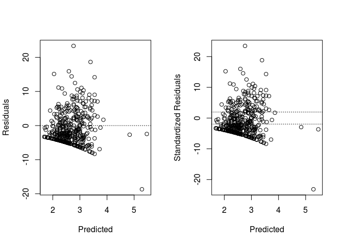
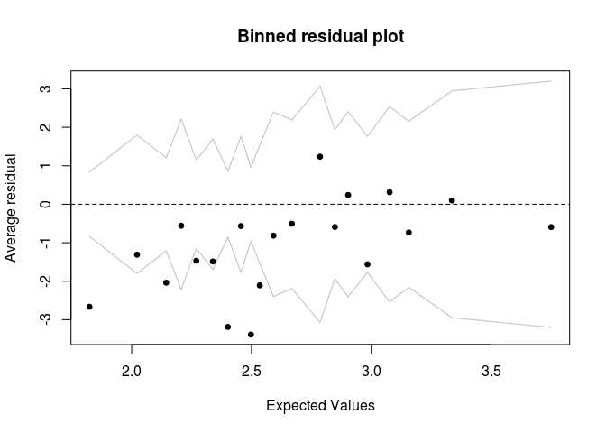
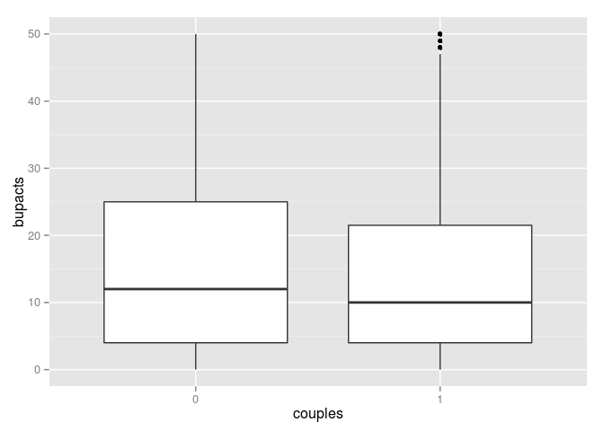

# Chapter 6 Problem 1 (Gelman & Hill)
Gianluca Rossi  
05/12/2015  

*Poisson regression: the folder `risky.behavior` contains data from a randomized trial targeting couples at high risk of HIV infection. The intervention provided counseling sessions regarding practices that could reduce their likelihood of contracting HIV. Couples were randomized either to a control group, a group in which just the woman participated, or a group in which both members of the couple participated. One of the outcomes examined after three months was “number of unprotected sex acts.”*


```r
require(AER)
require(arm)
require(foreign)
require(ggplot2)
```


```r
df <- read.dta("http://www.stat.columbia.edu/~gelman/arm/examples/risky.behavior/risky_behaviors.dta", convert.factors=TRUE)
df$fupacts <- round(df$fupacts)
df$couples <- factor(df$couples)
df$women_alone <- factor(df$women_alone)
summary(df)
```

```
##     sex      couples women_alone      bs_hiv       bupacts      
##  woman:217   0:272   0:288       negative:337   Min.   :  0.00  
##  man  :217   1:162   1:146       positive: 97   1st Qu.:  5.00  
##                                                 Median : 15.00  
##                                                 Mean   : 25.91  
##                                                 3rd Qu.: 36.00  
##                                                 Max.   :300.00  
##     fupacts      
##  Min.   :  0.00  
##  1st Qu.:  0.00  
##  Median :  5.00  
##  Mean   : 16.49  
##  3rd Qu.: 21.00  
##  Max.   :200.00
```

More informations regarding what each variable means can be found at this [URL](http://www.stat.cmu.edu/~brian/763/hw01/riskybehaviors.txt), as part of the material of the `36-763: Hierarchical Linear Models` class at CMU.

The experiment design is an interesting one because splits subjects into three groups:

`couple` | `women_alone` | description
-------- | ------------- | ------------- 
0        | 0             | control - no conselling
1        | 0             | the couple was counselled together 
0        | 1             | only the woman was counselled


### Part A

*Model this outcome as a function of treatment assignment using a Poisson regression. Does the model fit well? Is there evidence of overdispersion?*


```r
poi.reg <- glm(fupacts ~ women_alone, family=poisson, data=df)
display(poi.reg)
```

```
## glm(formula = fupacts ~ women_alone, family = poisson, data = df)
##              coef.est coef.se
## (Intercept)   2.92     0.01  
## women_alone1 -0.40     0.03  
## ---
##   n = 434, k = 2
##   residual deviance = 13064.2, null deviance = 13298.6 (difference = 234.4)
```

The model has a poor fit even though the `woman_alone` factor appears to be a statistically significant predictor. 


### Part B

*Next extend the model to include pre-treatment measures of the outcome and the additional pre-treatment variables included in the dataset. Does the model fit well? Is there evidence of overdispersion?* 


```r
df$c.bupacts <- (df$bupacts - mean(df$bupacts)) / (2 * sd(df$bupacts))
poi.reg.ext <- glm(fupacts ~ women_alone + sex + c.bupacts + couples + bs_hiv, family=poisson, data=df)
display(poi.reg.ext)
```

```
## glm(formula = fupacts ~ women_alone + sex + c.bupacts + couples + 
##     bs_hiv, family = poisson, data = df)
##                coef.est coef.se
## (Intercept)     3.18     0.02  
## women_alone1   -0.66     0.03  
## sexman         -0.11     0.02  
## c.bupacts       0.69     0.01  
## couples1       -0.41     0.03  
## bs_hivpositive -0.44     0.04  
## ---
##   n = 434, k = 6
##   residual deviance = 10200.4, null deviance = 13298.6 (difference = 3098.2)
```

The fit of the model has improved but is still far from optimal. This suggests there are still some missing predictors in our model which would help describe the variance of the outcome. 


```r
par(mfrow=c(1,2))
plot(predict(poi.reg.ext), residuals(poi.reg.ext), xlab="Predicted", ylab="Residuals")
abline(a=0, b=0, lty=3)
plot(predict(poi.reg.ext), rstandard(poi.reg.ext), xlab="Predicted", ylab="Standardized Residuals")
abline(a=1.96, b=0, lty=3)
abline(a=-1.96, b=0, lty=3)
```

 

As expected by the Poisson model, the variance of the residuals increases as the predicted values increase. From the graph above we can't easily check if the variance of the standardized residuals is constant, so we provide a binned plot with the aim of helping the reader.


```r
binnedplot(predict(poi.reg.ext), rstandard(poi.reg.ext))
```

 

The variance of the standardized residual is approximately constant. However, especially on low expected values, variance is much greater than 1, indicating overdispersion. Overdispersion should in fact be even higher of what shown in the binned plot. The binned plot in fact compares the average predicted values within the bin against the average residuals. Taking the average will reduce the variance, thus resulting in less overdispersion than what is actually happening.

A better alternative to check for overdispersion is to use the [Test for Overdispersion by Cameron & Trivedi](http://www.sciencedirect.com/science/article/pii/030440769090014K), as suggested by Momo in [CrossValidated](http://stats.stackexchange.com/a/66593/31998). 


```r
dispersiontest(poi.reg.ext, trafo=1)
```

```
## 
## 	Overdispersion test
## 
## data:  poi.reg.ext
## z = 5.5689, p-value = 1.282e-08
## alternative hypothesis: true alpha is greater than 0
## sample estimates:
##    alpha 
## 28.65146
```

The estimated overdispersion is extremely high, 28.65 in fact. The result of this test is very close to the approximation obtained using the formulation given by Gelman & Hill in the text.


```r
yhat <- predict (poi.reg.ext, type="response")
z <- (df$fupacts-yhat)/sqrt(yhat)
n = poi.reg.ext$df.null + 1
k = poi.reg.ext$df.null + 1 - poi.reg.ext$df.residual
cat("overdispersion ratio is ", sum(z^2)/(n-k), "\n")
```

```
## overdispersion ratio is  30.00404
```

```r
cat("p-value of overdispersion test is ", pchisq(sum(z^2), n-k), "\n")
```

```
## p-value of overdispersion test is  1
```


### Part C 

*Fit an overdispersed Poisson model. What do you conclude regarding effectiveness of the intervention?*

The basic correction for overdispersion is to multiply all regression
standard errors by $\sqrt{\text{overdispersion parameter}}$. Luckily, it turns out that our main inferences are not seriously affected. More simply, we can fit an overdispersed model using the quasipoisson family:


```r
df$c.bupacts <- (df$bupacts - mean(df$bupacts)) / (2 * sd(df$bupacts))
poi.reg.ext <- glm(fupacts ~ women_alone + sex + c.bupacts + couples + bs_hiv, family=quasipoisson, data=df)
display(poi.reg.ext)
```

```
## glm(formula = fupacts ~ women_alone + sex + c.bupacts + couples + 
##     bs_hiv, family = quasipoisson, data = df)
##                coef.est coef.se
## (Intercept)     3.18     0.12  
## women_alone1   -0.66     0.17  
## sexman         -0.11     0.13  
## c.bupacts       0.69     0.06  
## couples1       -0.41     0.15  
## bs_hivpositive -0.44     0.19  
## ---
##   n = 434, k = 6
##   residual deviance = 10200.4, null deviance = 13298.6 (difference = 3098.2)
##   overdispersion parameter = 30.0
```

We can conclude that the intervention had a positive impact on decreasing the number of unprotected sex acts. This is particularly evident looking at the coefficients of `women_alone` and `couples`. Briefly we can notice how couples where only the woman took part to counseling sessions saw a decrease in unprotected sex acts of $e^{-0.66} = 0.51685 $, this is equa to a 48.31% decrease in count. Interestingly when both partners took part to the counseling sessions the decrease was considerably smaller, just 33.63%. This could be partially explained by the differences in the baseline. If couples have on average less unprotected sex the difference in count will be smaller. We can quickly check this using two boxplots.


```r
ggplot(data=df, aes(x=couples, y=bupacts)) + geom_boxplot() + ylim(0, 50)
```

```
## Warning: Removed 63 rows containing non-finite values (stat_boxplot).
```

 

Our intuition seems to be right. Singles tends to have unprotected sex more often than couples. This could have a small impact on our results. To adjust for this issue we could fit a hierarchical model which add in the first level the average or median number of unprotected sex acts for each group. 

We also tried to fit a Poisson model with the number of unprotected sex acts reported at "baseline" (that is, at the beginning of the study) as an offset term. Using this formulation we can check the effectiveness of the treatment on different subjects adjusting for the baseline level.  


```r
df$offset <- ifelse(df$bupacts==0,1,df$bupacts) # avoid log(0) situations
poi.reg.off <- glm(fupacts ~ women_alone + sex + couples + bs_hiv, offset=log(offset), family=quasipoisson, data=df)
display(poi.reg.off)
```

```
## glm(formula = fupacts ~ women_alone + sex + couples + bs_hiv, 
##     family = quasipoisson, data = df, offset = log(offset))
##                coef.est coef.se
## (Intercept)    -0.03     0.15  
## women_alone1   -0.55     0.21  
## sexman         -0.12     0.16  
## couples1       -0.41     0.19  
## bs_hivpositive -0.31     0.24  
## ---
##   n = 434, k = 5
##   residual deviance = 10195.0, null deviance = 10736.5 (difference = 541.5)
##   overdispersion parameter = 46.6
```


### Part D

*These data include responses from both men and women from the participating couples. Does this give you any concern with regard to our modeling assumptions?*

Yes, this is a problem because the observations coming from the two elements of the couple won't be i.i.d. We are expecting an extremely high positive correlations between the answers of people part of the same couple. 
